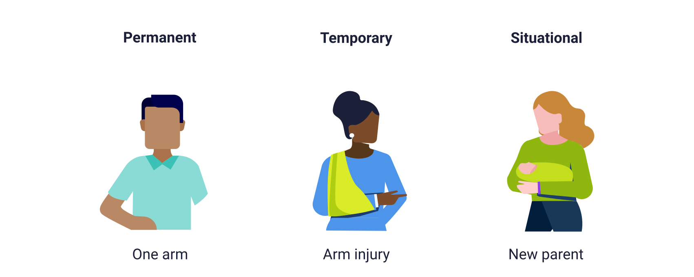
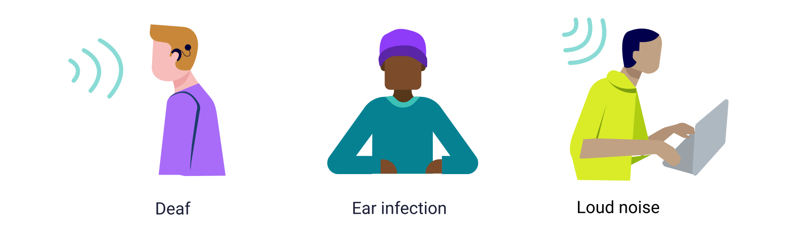
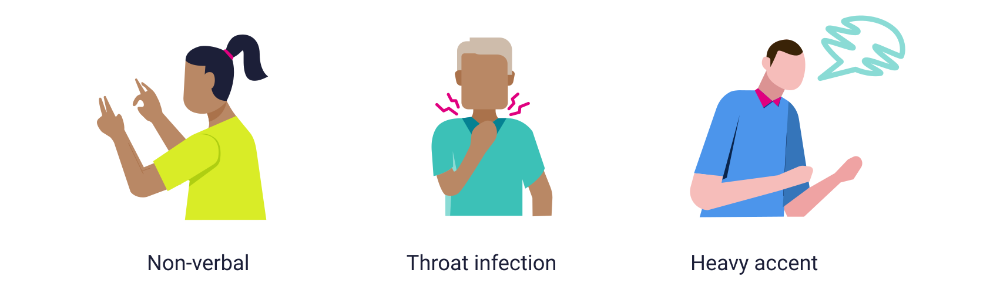
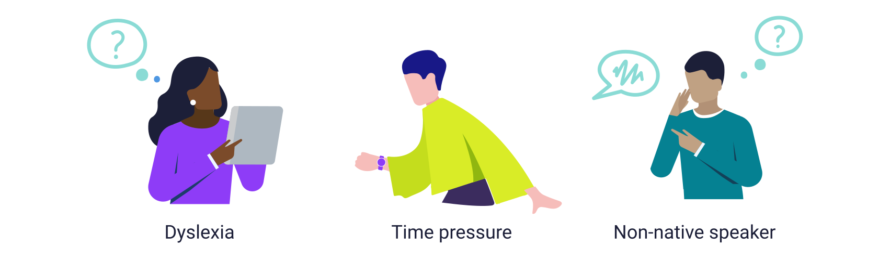
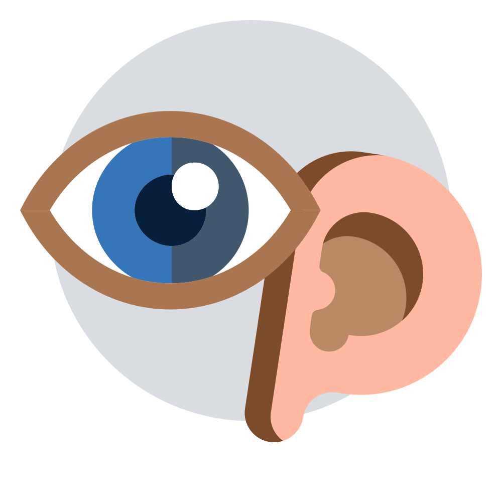

<!-- markdownlint-disable MD033 -->

Inclusive design ensures that a product can be used by the widest possible range of people.

To this end, designers must avoid considering only their own current abilities and biases, and
assume that users have varied capabilities of vision, hearing, touch, speech, or cognition. It is
estimated that at any given time, 1 in 7 people (worldwide, 1 in 4 in the U.S.) have diverse
abilities that can be situational, temporary, or permanent.

Inclusion is about understanding and supporting the flexibility for different user needs. Breaking
barriers that are created by non-inclusive technology and design, fosters equity and innovation.

The result is a product that is accessible to all users.

## Persona and diverse ability spectrum

Consider the different categories of barriers that might prevent users from using an application
unless an alternative way of accessing it is available. Imagine these restrictions affecting you or
someone you know.

  

    
  

  

    
Touch

    

      

        Missing limb(s)
      

      

        Limited fine motor skills (for example, tremor, or working with the non-dominant hand)
      

      

        Input device not available (no mouse, no keyboard)
      

    

  

  

    
  

  

    
See

    

      
Blindness

      
Low vision (blur)

      
Double-vision

      
Color blindness (there are various types)

      
Distraction

      
Display device not available or limited

      
Glare

    

  

  

    
  

  

    
Hear

    

      
Deafness

      
Reduced hearing

      
Environmental noise

      
Audio device not available

      
Audio output disturbing or disrupting

    

  

  

    
  

  

    
Speak

    

      
No voice

      
Language barrier (for example, accent)

      
Environmental noise

      
Audio interaction not available/suitable

    

  

  

    
  

  

    
Understand

    

      
Language barrier (for example, non-native speaker, dyslexia)

      
Anxiety (for example, critical action or time pressure)

      
Cognitive and learning restrictions (for example, due to age)

    

  

## Guidelines

As stated in the Web Content Accessibility Guidelines (WCAG), an application must be perceivable,
operable, understandable, and robust. Cumulocity products are expected to comply with level "AA" of
the WCAG 2.1 specification, or the Rehabilitation Act section 508, respectively (references below).

Some of these qualities are achieved by an application’s general design, some by the detailed
interaction and the components used, and some by ensuring "under the hood" support for assistive
technology. Note that while good design and implementation will go a long way, without testing you
will not be able to ensure that a product really achieves these goals. Ensure that the product use
cases are supported as efficient user journeys, and not simply by pressing the tab key several dozen
times on a page.

Here we summarize the most relevant guidelines.

  

    <h3 class="m-t-24 m-b-8">Understandable</h3>
    <ul class="p-l-16">
      <li class="m-b-8">Give pages a clear structure and a meaningful title</li>
      <li class="m-b-8">Apply a logical reading order to the elements on the page</li>
      <li class="m-b-8">Make appropriate use of heading levels</li>
      <li class="m-b-8">Identify the page’s natural language</li>
      <li class="m-b-8">Use language appropriate to the users</li>
      <li class="m-b-8">Do not use idiomatic language</li>
      <li class="m-b-8">Avoid over-reliance on user memory</li>
    </ul>
  

  

    
  

  

    <h3 class="m-t-24 m-b-8">Operable</h3>
    <ul class="p-l-16">
      <li class="m-b-8">Ensure all functionality is operable through a keyboard interface</li>
      <li class="m-b-8">Use keyboard accessible components: See the respective component guidelines</li>
      <li class="m-b-8">Avoid keyboard traps</li>
      <li class="m-b-8">Do not enforce specific timings for reading or input</li>
      <li class="m-b-8">Allow bypassing blocks of content (employ skip links; use :focus to make them visible)</li>
      <li class="m-b-8">Provide and document keyboard shortcuts</li>
      <li class="m-b-8">Ensure user control of animation, blinking, scrolling</li>
      <li class="m-b-8">Mark up dynamic content using aria-live</li>
      <li class="m-b-8">Do not rely on audio feedback</li>
      <li class="m-b-8">Ensure user control of audio output, especially with autoplay</li>
    </ul>
  

  

    
  

  

    <h3 class="m-t-24 m-b-8">Perceivable</h3>
    <ul class="p-l-16">
      <li class="m-b-8">Provide sufficient contrast for text and significant non-text content</li>
      <li class="m-b-8">Do not rely on color alone to convey information</li>
      <li class="m-b-8">Do not rely on images alone (Alt text for any non-text, non-decorative content)</li>
      <li class="m-b-8">Always show visual focus</li>
      <li class="m-b-8">Support speech presentation</li>
      <li class="m-b-8">Handle magnification gracefully; support 200%</li>
      <li class="m-b-8">Provide tight spacing option</li>
      <li class="m-b-8">Observe markup guidelines for the components (HTML or ARIA name, role, state)</li>
      <li class="m-b-8">Provide labels for form fields</li>
      <li class="m-b-8">Apply grouping (fieldset, legend)</li>
      <li class="m-b-8">Provide captioning of video/audio content</li>
    </ul>
  

  

    
  

  

    <h3 class="m-t-24 m-b-8">Robust</h3>
    <ul>
      <li class="m-b-8">Ensure different browsers and media players are supported</li>
      <li class="m-b-8">Ensure the content can be reliably parsed</li>
      <li class="m-b-8">Ensure that assistive technology works, for example, that status messages can be determined without receiving focus</li>
    </ul>
  

  

    
  

## External documents

<ul>
  <li>
    Web Accessibility Perspectives –
    <a href="https://www.youtube.com/watch?v=3f31oufqFSM" target="_blank" rel="noreferrer noopener"
      >Compilation of 10 Topics/Videos</a
    >
  </li>
  <li>
    W3C Web Content Accessibility Guidelines (WCAG)
    <a rel="noreferrer noopener" href="https://www.w3.org/TR/WCAG21/" target="_blank">2.1</a>: the
    definitive collection of accessibility recommendations
  </li>
  <li>
    WAI-ARIA Authoring Practices
    <a
      rel="noreferrer noopener"
      href="https://www.w3.org/TR/wai-aria-practices-1.1/"
      target="_blank"
      >1.1</a
    >: the guide to adding ARIA markup for ensuring a non-visual experience. Observe the caveat: no
    ARIA is better than bad ARIA, and be sure to read the
    <a
      rel="noreferrer noopener"
      href="https://www.w3.org/TR/wai-aria-practices-1.1/#no_aria_better_bad_aria"
      target="_blank"
      >explanation</a
    >
    of the 2 basic principles
  </li>
  <li>
    <a rel="noreferrer noopener" href="https://www.access-board.gov/ict/" target="_blank"
      >Rehabilitation&nbsp;act section 508</a
    >: the U.S. Government’s guidelines for accessibility of information and communication
    technology. WCAG has become more relevant; see this
    <a
      rel="noreferrer noopener"
      href="https://www.access-board.gov/ict/wcag2ict.html"
      target="_blank"
      >comparison</a
    >
  </li>
  <li>
    Microsoft&nbsp;Inclusive Design
    <a rel="noreferrer noopener" href="https://www.microsoft.com/design/inclusive/" target="_blank"
      >methodology</a
    >
    and toolkit&nbsp;<a
      rel="noreferrer noopener"
      href="https://download.microsoft.com/download/b/0/d/b0d4bf87-09ce-4417-8f28-d60703d672ed/inclusive_toolkit_manual_final.pdf"
      target="_blank"
      >manual</a
    >
  </li>
  <li>
    The
    <a
      rel="noreferrer noopener"
      href="https://www.itic.org/policy/accessibility/vpat"
      target="_blank"
      >VPAT</a
    >
    format from the Information Technology Industry Council (ITI) for reporting accessibility
    conformance. Especially government agencies require such statements for our products about which
    guidelines are fulfilled to which extent
  </li>
  <li>
    Accessibility
    <a
      href="https://uxdesign.cc/theres-no-such-thing-as-fully-automated-web-accessibility-260d6f4632a8"
      target="_blank"
      rel="noreferrer noopener"
      >cannot be fully automated</a
    >: be careful of products claiming otherwise
  </li>
  <li>
    Background information from the
    <a
      href="https://www.who.int/news-room/fact-sheets/detail/disability-and-health#"
      target="_blank"
      rel="noreferrer noopener"
      >WHO</a
    >, the
    <a
      href="https://www.cdc.gov/ncbddd/disabilityandhealth/infographic-disability-impacts-all.html"
      target="_blank"
      rel="noreferrer noopener"
      >CDC</a
    >,
    <a href="https://www.microsoft.com/design/inclusive/" target="_blank" rel="noreferrer noopener"
      >Microsoft</a
    >
  </li>
</ul>

## Tools

<ul>
  <li>
    Deque
    <a href="https://dequeuniversity.com/color-contrast" target="_blank" rel="noreferrer noopener"
      >Color Contrast Analyzer</a
    >
  </li>
  <li>
    <a
      rel="noreferrer noopener"
      href="https://chrome.google.com/webstore/detail/color-contrast-analyzer/dagdlcijhfbmgkjokkjicnnfimlebcll"
      target="_blank"
      >Color Contrast Analyzer</a
    >
    for Chrome
  </li>
  <li>
    <a
      rel="noreferrer noopener"
      href="https://addons.mozilla.org/en-US/firefox/addon/wcag-contrast-checker/"
      target="_blank"
      >WCAG Contrast Checker</a
    >
    for Firefox
  </li>
  <li>
    <a
      href="https://www.color-blindness.com/coblis-color-blindness-simulator/"
      target="_blank"
      rel="noreferrer noopener"
      >Color Blindness Simulator</a
    >
    by Colblindor
  </li>
  <li>
    Online
    <a
      href="https://www.colorlitelens.com/color-blindness-test.html"
      target="_blank"
      rel="noreferrer noopener"
      >color-blindness test</a
    >
  </li>
  <li>
    <a
      rel="noreferrer noopener"
      href="https://chrome.google.com/webstore/detail/aria-validator/oigghlanfjgnkcndchmnlnmaojahnjoc"
      target="_blank"
      >ARIA Validator</a
    >
    for Chrome
  </li>
  <li>
    <a
      rel="noreferrer noopener"
      href="https://www.figma.com/community/plugin/734693888346260052/Able-%E2%80%93-Friction-free-accessibility"
      target="_blank"
      >Able accessibility plugin</a
    >
    for Figma
  </li>
  <li>
    <a href="https://www.deque.com/axe/" target="_blank" rel="noreferrer noopener">Axe</a> toolset
    by Deque
  </li>
  <li>
    <a href="https://wave.webaim.org/" target="_blank" rel="noreferrer noopener"
      >WAVE Web Accessibility Evaluation Tool</a
    >, including Chrome and Firefox extensions
  </li>
</ul>
