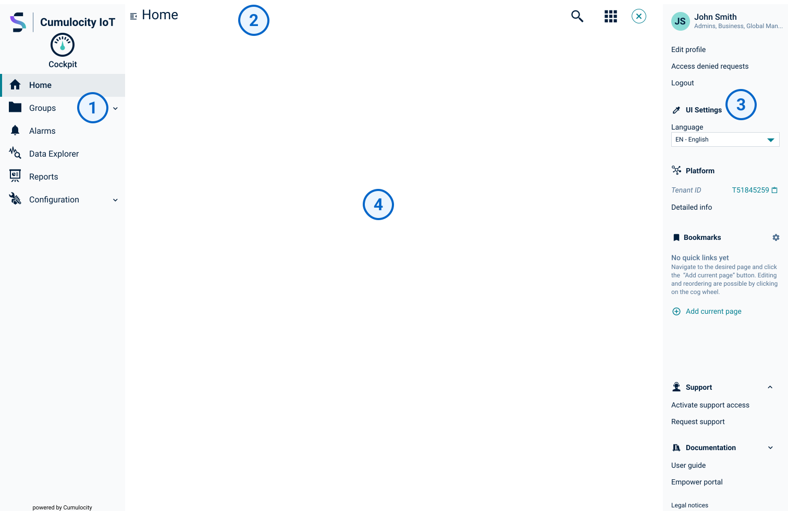
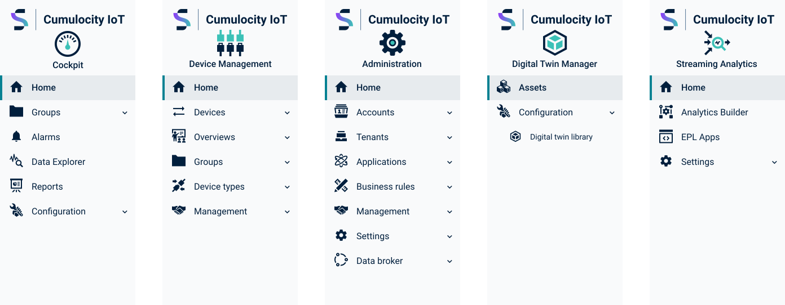
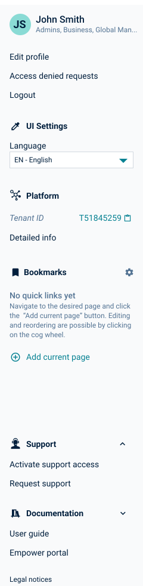
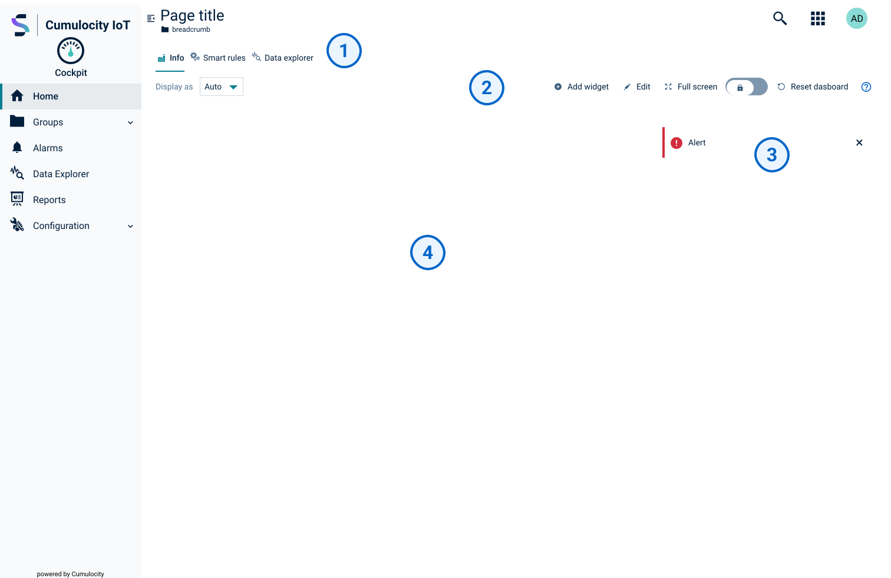

<!-- markdownlint-disable MD033 -->
<!-- markdownlint-disable MD037 -->
<!-- markdownlint-disable MD025 -->
<!-- markdownlint-disable MD051 -->

The general application UI structure, common to all Cumulocity applications.

## Application layout

The application layout is composed by four main sections:  
The "Navigator", the "Main header", the "Right drawer", and the "Main content"

  

    

      1
      

        <strong>Navigator</strong>
        
The application's main navigation. A tree indicates the content's hierarchy. It's collapsed below 1200px wide viewports.

      

    

  

  

    

      2
      

        <strong>Main header</strong>
        <ul class="p-l-0">
          <li>The navigator toggle button</li>
          <li>The page title and breadcrumbs</li>
          <li>Optional search</li>
          <li>Application switcher</li>
          <li>User badge that toggles the right drawer</li>
        </ul>
      

    

  

  

    

      3
      

        <strong>Right drawer</strong>
        <ul class="p-l-0">
          <li>The user identification</li>
          <li>The user menu</li>
          <li>The UI settings menu</li>
          <li>Platform menu</li>
          <li>Bookmarks</li>
          <li>Support</li>
          <li>Documentation links</li>
          <li>The legal notices link</li>
        </ul>
      

    

  

  

    

      4
      

        <strong>Main content</strong>
        
This section uses a 12 column grid and expands vertically.

      

    

  

## Navigator

The navigator has the platform brand logo, name and icon of the current application, and the
navigation with a list of entries leading to the various sections of the application.

Each navigation entry has a specific icon, device icons also display device connectivity status.
It allows drag-and-drop on devices and groups for easier organization.

By default, the navigator collapses on screens smaller than 1200px.

## Main header

Holds the navigator toggle button, page title, breadcrumbs, optional search, application switcher, and the user badge that also toggles the right drawer.

It may hold other components which are optional and application-specific.

## Right drawer

The right drawer has two sections: Quick links and Help & Support.  

Its primary function is to help users quickly access often-used areas and support doubts when using the site in general or accessing particular sections of the documentation.

## Main content

This section holds four content areas: Tabs, Action bar, Alerts, and the page content.

  

    

      1
      

        <strong>Tabs</strong>
        
A tab allow to switch routes on a page. Two options: horizontal tabs and vertical tabs.

      

    

  

  

    

      2
      

        <strong>Action bar</strong>
        
An action bar item is a action in scope of a current route of the application.

      

    

  

  

    

      3
      

        <strong>Alerts</strong>
        
The platform feedback mechanism to communicate important information after the user or the system.

      

    

  

  

    

      4
      

        <strong>Page content</strong>
        
The page content uses a 12 columns grid and expands vertically.

      

    

  

