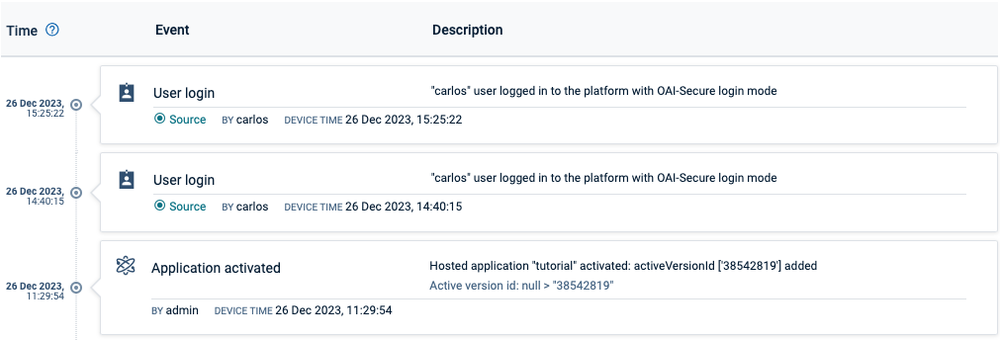
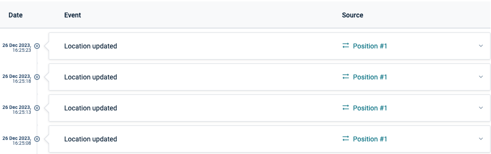

<!-- markdownlint-disable MD025 -->
<!-- markdownlint-disable MD033 -->

A timeline list is a chronological timeline of activity on a given item.

Displays a chronological timeline that effectively organizes events in chronological order,
providing a clear representation of the temporal progression.

  
  

