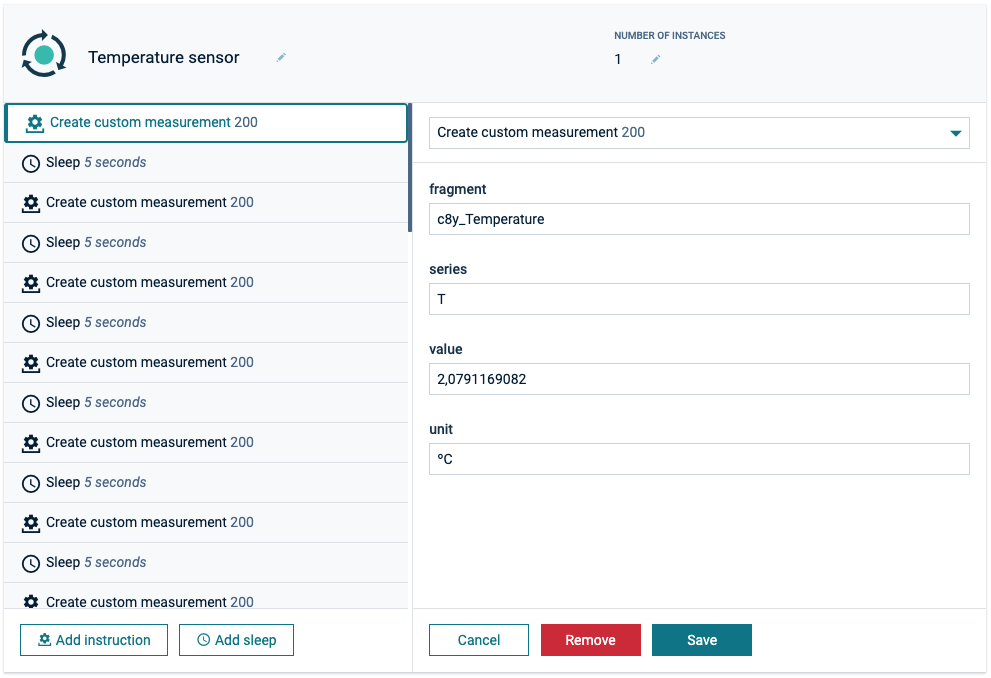
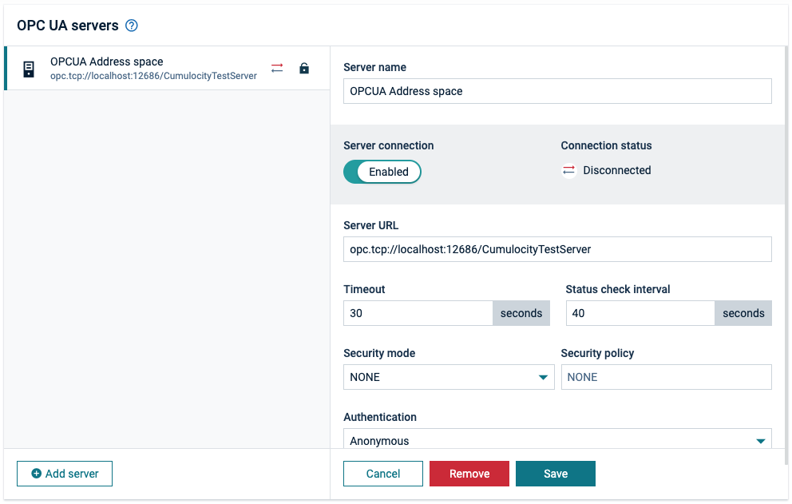

<!-- markdownlint-disable MD025 -->
<!-- markdownlint-disable MD033 -->

The split view is ideal for working through a queue of items. It allows the user to stay on the same screen while
viewing and editing multiple items.

## Examples

Selecting a record from a list, displays the detail on the right-hand side.

  
  

