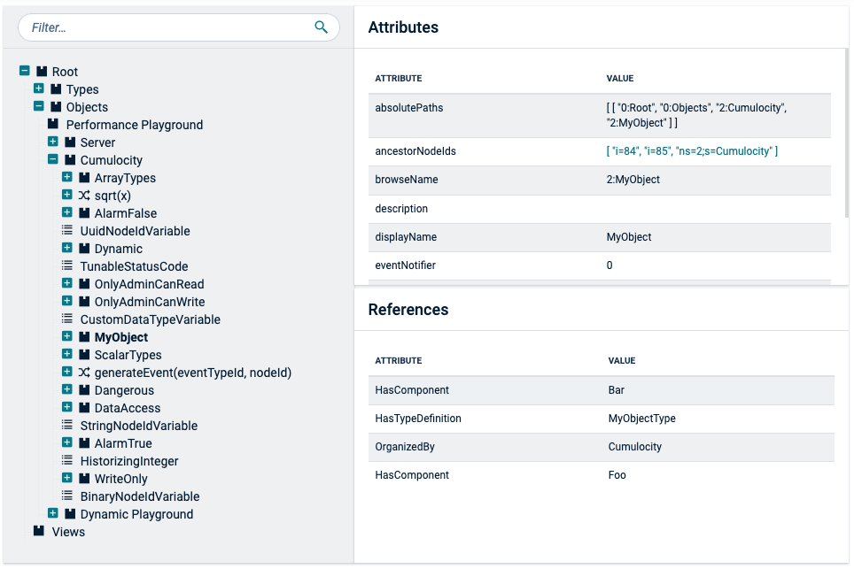

<!-- markdownlint-disable MD033 -->

The tree list is useful for displaying large amounts of hierarchical data on parent-child relationships group records.

## Examples

A plus button at the beginning of the row shows and hides nested children. It also indicates whether
a record has children. Children are indented below their parent to communicate their position in the
hierarchy.

  

