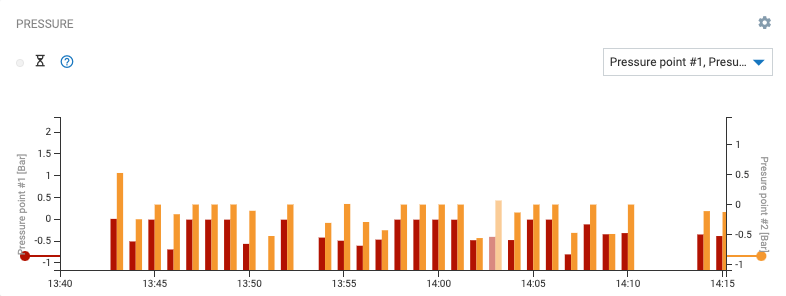
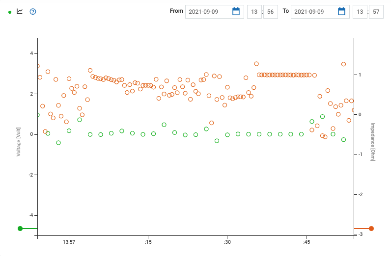
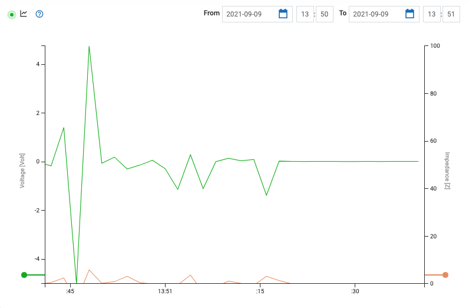
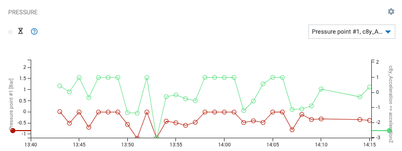
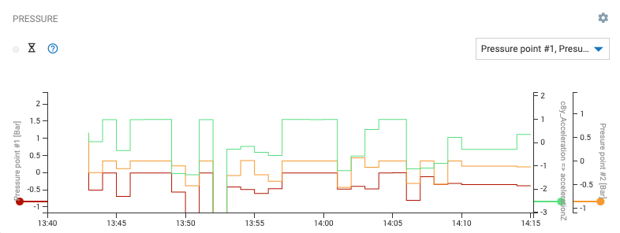
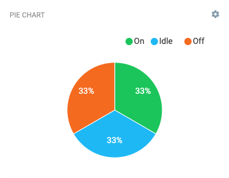
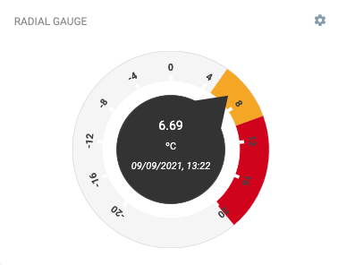
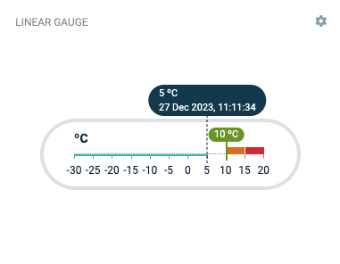
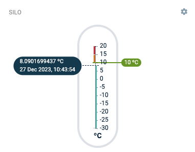
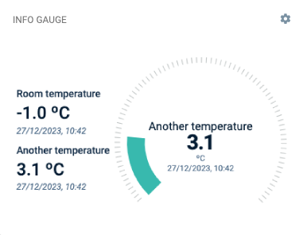

<!-- markdownlint-disable MD025 -->
<!-- markdownlint-disable MD033 -->

Data visualization involves the creation and study of the visual representation of data. Useful
visualization helps users analyze and reason about data and evidence. It makes complex data more
accessible, understandable and usable.

To communicate information clearly and efficiently, uses statistical graphics, plots, information
graphics and other tools. Numerical data may be encoded using dots, lines, or bars, to communicate a
quantitative message visually.

Users may have particular analytical tasks, such as making comparisons or understanding causality,
and the design principle of the graphic (that means, showing correlations or showing causality) follows
the function. Use tables where users will look up a specific measurement, while charts of various
types are used to indicate patterns or relationships in the data for one or more variables.

## Examples

### Charts

#### Bar chart

Visualize a series or multiple series of numeric values as a bar chart or stacked bar chart.

Each series is represented by a sequence of horizontally aligned rectangle bars, the height of each
proportionally representing a value.

  

#### Point chart

Visualize a series or multiple series of numeric values as a point chart.

Each series is represented by a sequence of outlined circles.

  

#### Line chart

A line chart or line graph is a type of chart which displays information as a series of data points
called 'markers' connected by straight line segments.

A line chart is often used to visualize a trend in data over intervals of time, a time series, therefore the line is often drawn chronologically.

  

#### Line and points chart

A line and points chart displays information as mix of both a line chart and a point chart.

  

#### Step chart

A step chart is a type of chart which connects a series of data points by straight line segments,
called 'Steps'.

There are two options: 'Step before' or 'Step after'.

  

#### Pie chart

A pie chart is a circular statistical graphic which is divided into slices to illustrate numerical
proportion. In a pie chart, the arc length of each slice (and consequently its central angle and
area), is proportional to the quantity it represents. While it is named for its resemblance to a pie
which has been sliced, there are variations on the way it can be presented.

  

### Gauges

#### Radial gauge

A radial gauge has the same attributes as the bullet graph, but has a pivot point around which its
pointers rotate, plus a radial scale. By default, the radial scale forms a complete 360-degree
circle but can be easily changed to display as an arc by adjusting its start and sweep angles.

  

#### Linear gauge

A linear gauge has the same attributes as the radial gauge, but with a linear scale.

  

#### Silo gauge

A silo gauge has the same attributes as the linear gauge, but vertical.

  

#### Info gauge

An info gauge has the same attributes as the radial gauge, with more detailed info.

  

<!-- TODO when available -->

<!-- <h2>Spark line</h2>

A sparkline is a very small line chart, typically drawn without axes or coordinates. It presents the general shape of the variation (typically over time) in some measurement, such as temperature or stock market price, in a simple and highly condensed way.

Sparklines are small enough to be embedded in text, or several sparklines may be grouped together as elements of a small multiple. Whereas the typical chart is designed to show as much data as possible, and is set off from the flow of text, sparklines are intended to be succinct, memorable, and located where they are discussed

 

 -->

<!-- <h2>Area chart</h2>

An area chart displays graphically quantitative data. It is based on the line chart, but the area between axis and line is emphasized with color.

Commonly one compares with an area chart two or more quantities.

  

<h2>Bullet graph</h2>

The bullet graph features a single, primary measure (for example, temperature), compares that measure to one or more other measures to enrich its meaning (for example, compared to a target), and displays it in the context of qualitative ranges of performance, such as warning, satisfactory, and good.

  

 -->

<!-- <h2>Scatter plot</h2>

A scatter plot (also called a scatterplot, scatter graph, scatter chart, scattergram, or scatter diagram) is a type of plot or mathematical diagram using Cartesian coordinates to display values for typically two variables for a set of data.

If the points are color-coded, one additional variable can be displayed. The data are displayed as a collection of points, each having the value of one variable determining the position on the horizontal axis and the value of the other variable determining the position on the vertical axis.

  

<h2>Timeseries chart</h2>

A time series is a series of data points indexed (or listed or graphed) in time order. Most commonly, a time series is a sequence taken at successive equally spaced points in time. Thus it is a sequence of discrete-time data.

  

<h2>Parallel coordinates</h2>

Parallel coordinates are a common way of visualizing high-dimensional geometry and analyzing multivariate data.

To show a set of points in an n-dimensional space, a backdrop is drawn consisting of n parallel lines, typically vertical and equally spaced. A point in n-dimensional space is represented as a polyline with vertices on the parallel axes; the position of the vertex on the i-th axis corresponds to the i-th coordinate of the point.

This visualization is closely related to time series visualization, except that it is applied to data where the axes do not correspond to points in time, and therefore do not have a natural order.

  

<h2>Radar chart</h2>

A radar chart is a graphical method of displaying multivariate data in the form of a two-dimensional chart of three or more quantitative variables represented on axes starting from the same point.

The relative position and angle of the axes is typically uninformative.

  

 -->
