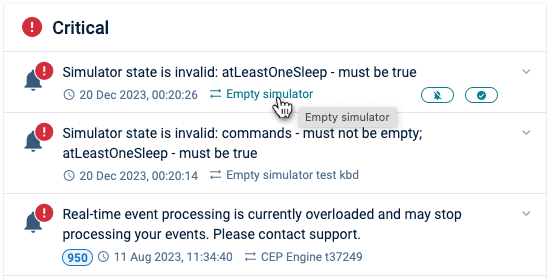
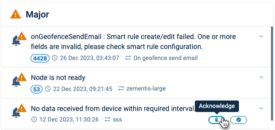
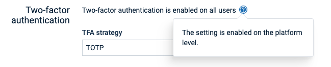
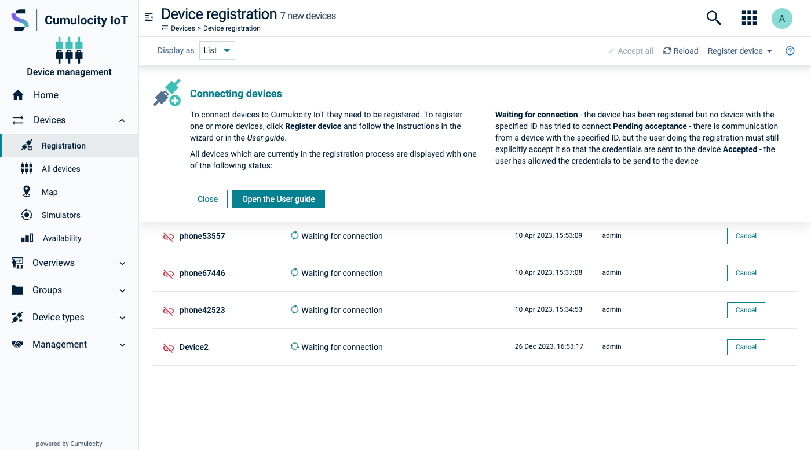
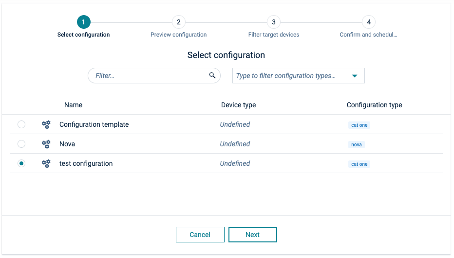
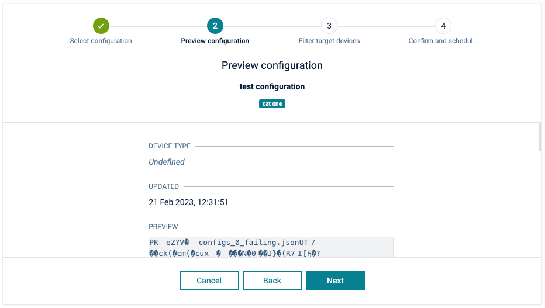
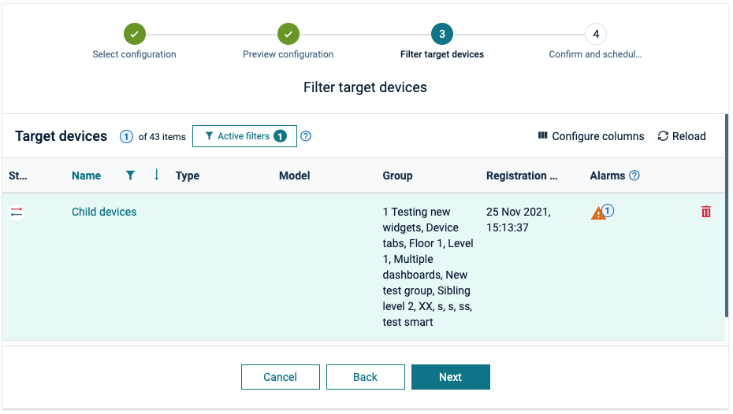
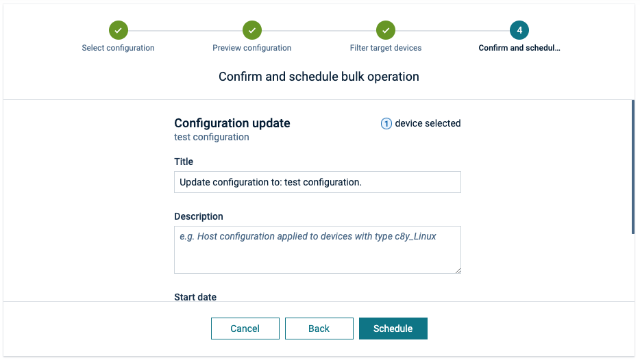

<!-- markdownlint-disable MD025 -->
<!-- markdownlint-disable MD033 -->
<!-- markdownlint-disable MD051 -->

Having a [comprehensive documentation system](https://cumulocity.com/docs), seems just natural
to offer contextual, appropriate, and adaptive support.

## Three key qualities for an effective help system

  

    

      <i c8yIcon="centralized-network" class="c8y-icon-duocolor"></i>
    

    <h3 class="card-title ">Availability without Interference</h3>
    

      Help resources must be readily available to users without obstructing their primary tasks. When assistance is required, it must be easy to locate.
    

  
  
  

    

      <i c8yIcon="omnichannel" class="c8y-icon-duocolor"></i>
    

    <h3 class="card-title ">Unintrusive</h3>
    

     After seeking help, users have to be able to seamlessly return to their original task without any disruptions.
    

  
  
  

    

      <i c8yIcon="string" class="c8y-icon-duocolor"></i>
    

    <h3 class="card-title ">Succinct yet descriptive</h3>
    

     Help messages must be concise, using only the necessary words to convey the information in an easily understandable manner.
    

  
  

## Levels of assistance

### Tooltips

Every button or link has to be accompanied by a tooltip to offer users additional information about
the associated action or link. You can enable this feature simply by adding a `title` parameter to
each button or link.

For more detailed supplementary information, such as when hovering over an icon, consider utilizing
the [tooltip](#/components/tooltip) component.

  

    

      
    

    

      
    

  

### Inline help

When you have longer content that can't fit within a tooltip, consider using the
[inline help](#/components/help/overview#inline-help) component.

    

      
    

### Contextual help

For situations where a more extensive explanation is necessary, display the help content directly on
the page. This approach provides in-depth insights into specific processes.

Check the [Contextual help](#/components/help/overview#contextual-help) component.

  

    

      
    

  

### Inline help

For brief explanations (shorter than a sentence), you can position the text beneath the input field.
If the explanation is lengthier, think about employing a popover. Additionally, consider using
placeholder text to provide examples when necessary.

Refer to [Inline help](#/components/help/overview#inline-help) for more information.

  

    

      

        <label for="inputHelpBlock">Email</label>
        <input type="email"
          id="inputHelpBlock"
          class="form-control"
          placeholder="e.g. email@example.com (required)">
        A short block of help text.
      

      

        <label for="inputHelpBlock2">IMEI</label>
        <input type="email"
          id="inputHelpBlock2"
          class="form-control"
          placeholder="e.g. 154827859688154">
      

    

  

## Guidance

Certain features may involve complex configuration processes. In such cases, it is beneficial to provide a step-by-step wizard to guide users through the process.

For more information, refer to the [Stepper](#/components/stepper/overview) component.

  

    

      <h4>Step 1</h4>
    

    

      
    

  

  

    

      <h4>Step 2</h4>
    

    

      
    

  

  

    

      <h4>Step 3</h4>
    

    

      
    

  

  

    

      <h4>Step 4</h4>
    

    

      
    

  

