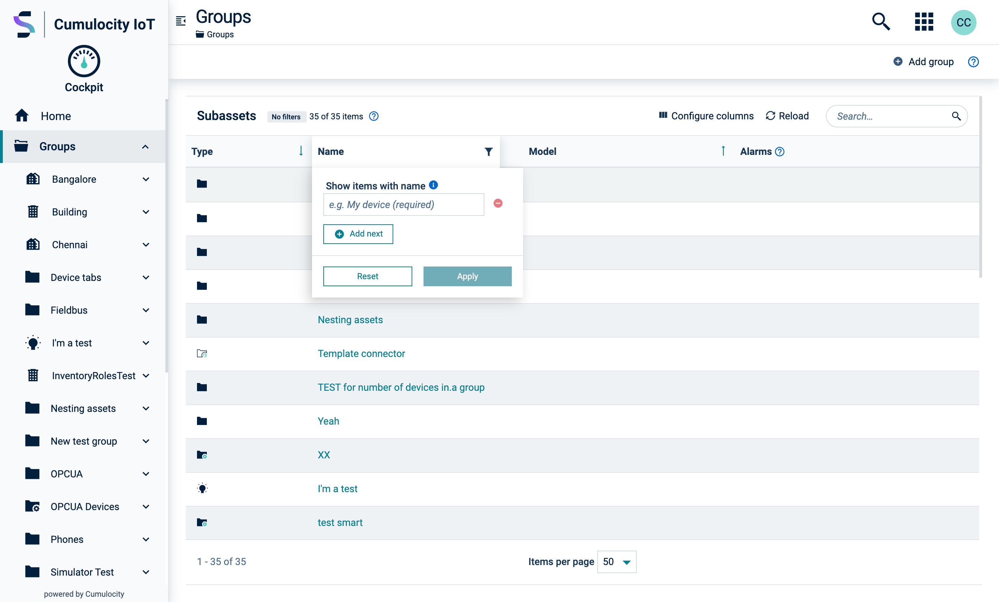

<!-- markdownlint-disable MD025 -->
<!-- markdownlint-disable MD033 -->
<!-- markdownlint-disable MD051 -->

List layouts are specifically designed to optimize the user's ability to read important information
and easily perform relevant operations.

When creating a list layout, it is crucial to prioritize
readability and operability, consider the following:

- **Identify the importance of information**:  
Evaluate the context and determine the significance of different types of information. Display only
key information and relevant actions to streamline the user's focus and avoid overwhelming them with
unnecessary details.

- **Differentiate item types**:  
If your list contains multiple item types, consider separating them into different lists or clearly
labeling them within the list. This differentiation helps users quickly identify and comprehend the
content.

- **Enable progressive access to complex content**:  
When dealing with complex content within the list, allow users to access the information in a
progressive manner. This can be achieved through collapsible sections or expanding details, ensuring
a manageable display of content.

- **Use visible affordances for interactions**:  
If there are only one or two points of interaction within each record, it is recommended to add a
visible affordance, such as an icon or a button. However, if there are more than two interaction
points, it is advisable to group them within a dropdown menu to maintain a clean and organized
design.

## Tabular data

A table is the most basic format for displaying a list of records. Each record is represented by a
single row of data that starts with the record's primary field and shows additional fields in
subsequent columns. The data is labeled using column headers, which can be interactive.

This layout is best suited for sorting, filtering, and selecting a large number of records.

### Data-grid

Whenever possible, use the [Data-grid](#/components/data-grid) component as it provides advanced
interaction controls for record lists and is fully responsive. Wrap the data-grid with a
`.content-fullpage` class to ensure it uses the full height of the page while keeping both the
header and footer fixed.

<codex-tutorial-example class="c8y-codex-override">
  

<!-- important -->

  <!-- place your data grid here -->
<!-- /important --><!-- important -->

<!-- /important -->
  

</codex-tutorial-example>

### Table

You can also use a [Table](#/components/table). Simply add the `.page-sticky-header` class to the
table head to freeze the column headers.

<codex-tutorial-example class="c8y-codex-override">

  

<!-- important -->
<table class="table table-striped">
  <colgroup>
    <col width="5%" />
    <col width="20%" />
    <col width="30%" />
    <col width="20%" />
    <col width="25%" />
  </colgroup>
  <thead>
    <tr class="page-sticky-header">
      <th></th>
      <th>Name</th>
      <th>Description</th>
      <th>ID</th>
      <th>Last update</th>
    </tr>
  </thead>
  <tbody>
    <tr *ngFor="let record of route.snapshot.data.mockdata">
      <td><i [c8yIcon]="record.icon"></i></td>
      <td>{{record.name}}</td>
      <td>{{record.description}}</td>
      <td>{{record.id}}</td>
      <td>{{record.lastUpdated | c8yDate: 'medium' }}</td>
    </tr>
  </tbody>
</table>
<!-- /important -->

</codex-tutorial-example>

## List group

The [List group](#/components/list-group) is suitable for displaying record lists that only present
essential information. Additional information can be placed in a collapsible container or a details
page.

Each item in the list contains a primary field and may include supporting icons, a checkbox, a
toggle switch, or additional fields.

When incorporating the `.page-sticky-header` class, ensure that you structure the content as
`c8y-li-body` so that the columns align correctly, providing a consistent and visually
appealing display.

Additionally, consider using either the [Pagination](#/components/pagination) or the
[Virtual scroll](#/components/list-group/overview#virtual-scroll--default-strategy) to handle
pagination effectively.

<codex-tutorial-example class="c8y-codex-override">
  

    

<!-- important -->
<c8y-list-group>
  <!-- the .page-sticky-header -->
  <c8y-li
    class="page-sticky-header hidden-xs hidden-sm c8y-list__item--empty-actions"
    *ngIf="route.snapshot.data.mockdata.length > 0"
  >
    <c8y-li-icon>
      <i class="p-l-24"></i>
    </c8y-li-icon>
    <c8y-li-body>
      

        
Name

        
Owner

        
Type

        
Last update

      

    </c8y-li-body>
  </c8y-li>
  <!-- The record list -->
  <c8y-li
    #li
    *ngFor="let record of route.snapshot.data.mockdata"
  >
    <c8y-li-icon [icon]="record.icon"></c8y-li-icon>
    <c8y-li-body>
      

        

          <button class="btn-clean c8y-list__item__title"
          (click)="li.toggleCollapsed()">{{record.name}}</button>
        

        

          {{record.owner}}
        

        

          

            {{record.type}}
          

        

        

          <small class="icon-flex">
            <i c8yIcon="calendar"></i>
            {{record.lastUpdated | c8yDate: 'medium' }}
          </small>
        

      

    </c8y-li-body>
    <c8y-li-collapse>
      

        

          
Registration date

          

            <small class="icon-flex">
              <i c8yIcon="calendar"></i>
              {{record.creationTime | c8yDate: 'medium' }}
            </small>
          

          
Value

          
{{record.value}}

          
            
Unit

            
{{record.unit}}

          
        

        

          
Description

          
{{record.description}}

        

      

    </c8y-li-collapse>
  </c8y-li>
</c8y-list-group>
<!-- /important -->
    

  

</codex-tutorial-example>

### Timeline list

To display a list of records in chronological order, use the
[list group timeline](#/components/list-group/overview#list-item-timeline) variant. This variant is
specifically designed for presenting records in a timeline format.

<codex-tutorial-example class="c8y-codex-override">
  

    

    <!-- important -->
<!-- the .page-sticky-header -->

  

    

      

        Date
      

    

    

      

        

          
Name

          
Owner

          
Type

          
Registration date

        

      

    

  

<!-- The record list -->
<c8y-list-group>
  <c8y-li-timeline
    *ngFor="let record of route.snapshot.data.mockdata"
  >
    {{record.lastUpdated | c8yDate: 'medium' }}
    <c8y-li>
      <c8y-li-body>
        

          

            {{record.name}}
          

          
{{record.owner}}

          

{{record.type}}

          

            <small class="icon-flex"
              ><i c8yIcon="calendar"></i>{{record.creationTime | c8yDate: 'medium' }}</small
            >
          

        

      </c8y-li-body>
    </c8y-li>
  </c8y-li-timeline>
</c8y-list-group>
    <!-- /important -->
  

  

</codex-tutorial-example>

## Cards grid/list

To enhance the user experience, you have the option to showcase records using
[cards](#/components/card) in a [grid layout](#/components/card-group). To optimize this experience
further, consider integrating the List Display Switch component into the Action Bar. This valuable
component empowers users to effortlessly select their desired display style from three options:
auto, list, and grid.

By default, when there are 13 or fewer records, they will be displayed in a grid format. If there
are more than 13 records, they will be shown in a list format similar to the list group. This
ensures optimal visibility and usability for users.

You have to include the [List display switch](#/components/list-display-switch/) component in the
[Action bar](#/develop/hooks/action-bar/overview).

The [Card](#/components/card) may contain any type of content, but in this context its primary
function is to provide access the details page.

<codex-tutorial-example class="c8y-codex-override">
  

<!-- important -->
<!-- Include in the action bar -->
<c8y-list-display-switch
  class="form-inline"
  (onListClassChange)="listClass = $event"
  [listLength]="route.snapshot.data.mockdata.length"
></c8y-list-display-switch>
<!-- /important -->
  

  

    

<!-- important -->
<!-- The record list wrapper -->

  <!-- The sticky header -->
  

    

      

        
Name

      

      

        
Description

      

      

        
Genre

      

    

  

  <!-- The records list -->
  

    

      

        

          <i c8yIcon="{{record.icon}}" class="c8y-icon"></i>
        

        {{record.name}}
      

      

        <small>
            {{record.description}}
        </small>
      

      

         {{ record.type}}
      

    

  

<!-- /important -->
  

</codex-tutorial-example>
