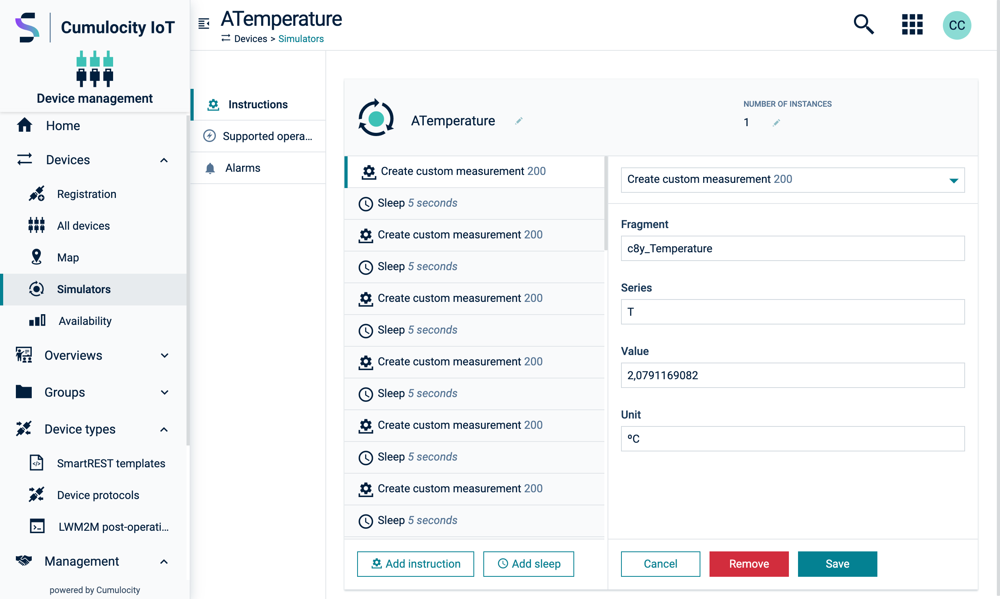

<!-- markdownlint-disable MD025 -->
<!-- markdownlint-disable MD033 -->
<!-- markdownlint-disable MD051 -->

It is the ideal layout for working through a queue of records by allowing users to stay on the same
screen while viewing and editing items.

The card contains a grid with two columns: the first to hold a list of records and the second to
display the record details.

<codex-tutorial-example class="c8y-codex-override">
  

  
  <!-- important -->
  <!-- use the `split-view--*-*` classes to set both column widths -->
  

  <!-- Optional element using the `grid__col--fullspan` to span all columns -->
  

    <!-- content -->
    <em>Top area content</em>
  

    <!-- The Records list. Use the `inner-scroll` to handle the overflow  -->
  

    <!-- use `bg-level-1` to set the background color and
        use `flex-grow` to take all the available height -->
    

      <!-- use the `c8y-nav-stacked` component to display the record list -->
      
<em>The records list</em>

    

    <!-- use the `card-footer` class together with `sticky-bottom` to fix the footer at the bottom -->
    

      <button title="Add record" class="btn btn-default" >
        <i c8yIcon="plus-circle-o"></i>
        Add record
      </button>
    

  

    <!-- Record detail. Use the `inner-scroll` class to display a scrollbar when needed  -->
    <!-- apply the `split-view__detail--selected` when a record is selected.
          this is required for proper display in small screens (tablet and smartphone)-->
  

  <!-- Add a `card-header` to hold a `back` button only displayed in tablet and smartphones
      use the `sticky-top` class to make it fixed to the top
  -->
    

      <button class="btn btn-clean text-primary" title="Back">
        <i c8y-icon="chevron-left" class="dlt-c8y-icon-chevron-left"></i>Back
      </button>
    

    <!--  use `flex-grow` to take all the available height and push the footer (when it exists) to the bottom -->
    

      <em>Record detail</em>
    

    <!-- use the `card-footer` class together with `sticky-bottom` to fix the footer at the bottom -->
    

      <!-- when providing a `cancel` button, ensure that it will remove the
        `split-view__detail--selected` class from the `split-view__detail` element
        -->
      <button title="Cancel" class="btn btn-default">Cancel</button>
      <button title="Remove" class="btn btn-danger">Remove</button>
      <button title="Save" class="btn btn-primary">Save</button>
    

  

  

  <!-- /important -->
  

</codex-tutorial-example>
