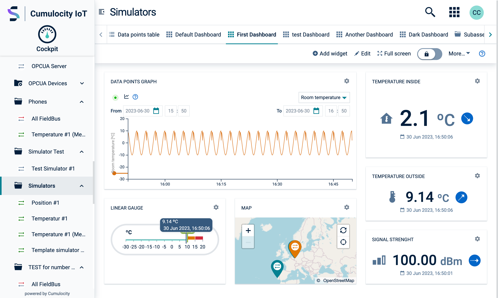
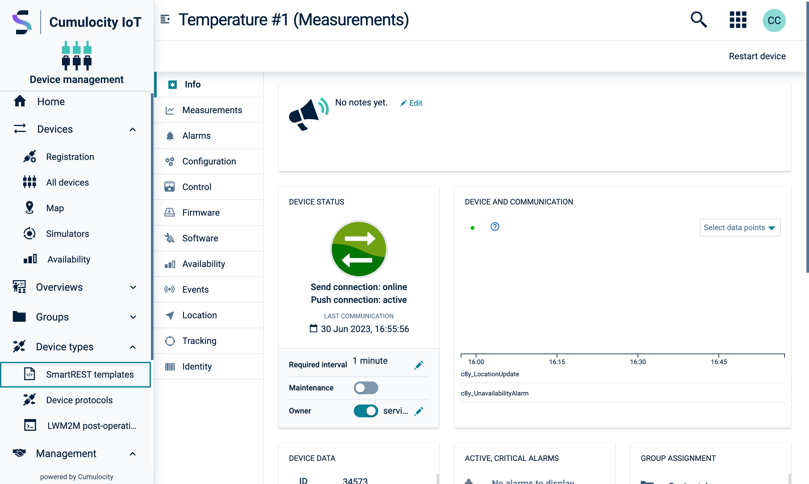
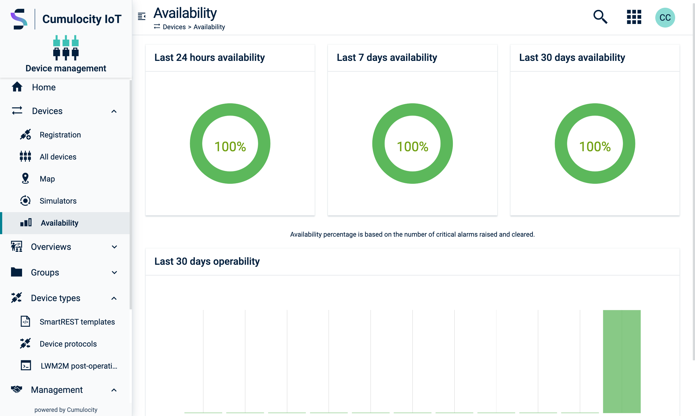

<!-- markdownlint-disable MD007 -->
<!-- markdownlint-disable MD025 -->
<!-- markdownlint-disable MD033 -->
<!-- markdownlint-disable MD051 -->

Dashboards are layouts for presenting high-level information and guiding users to related details
and actions. They allow users to understand key details as well as the overall situation in an
intuitive way.

## User generated dashboard

Composed by a set of `.card-dashboard` holding widgets, it allows the user to manage each
card-dashboard size, position, and widget content. It requires the
[action-bar](#/develop/hooks/action-bar/overview) hook for customization options (name, theme, and
widgets) and for adding new widgets.

<codex-tutorial-example class="c8y-codex-override c8y-codex-override--no-code">

  

</codex-tutorial-example>

## System generated dashboard

Similar to the user-generated dashboard, except that each `.card-dashboard` widgets and position are
predefined programmatically. User customization is not available.

The action bar is optional.

<codex-tutorial-example class="c8y-codex-override c8y-codex-override--no-code">

  

</codex-tutorial-example>

## Section overview dashboard

Built entirely with HTML markup, this type of dashboard layout provides great flexibility by using
the [grid system](#/utilities/using-the-grid). Place the `.card`s inside
the column containers to ensure the right alignment and spacing.

To keep all cards balanced on each row, replace the `.row` by a `.card-group`.

<codex-tutorial-example class="c8y-codex-override">

  
  <!-- important -->

  

    

      

        
Card title

      

      

        Card content
      

    

  

  

    

      

        
Card title

      

      

        Card content
      

    

  

  

    

      

        
Card title

      

      

        Card content
      

    

  

  

    

      

        
Card title

      

      

        Card content
      

    

  

<!-- /important -->

</codex-tutorial-example>
