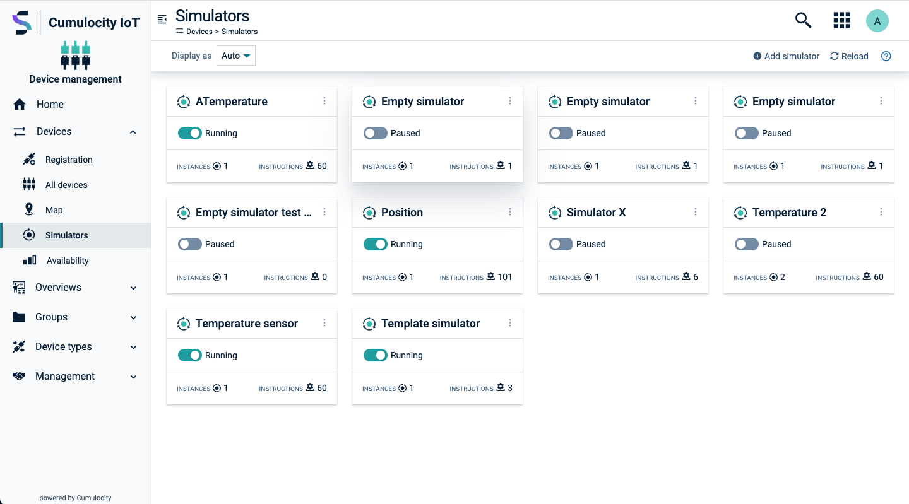
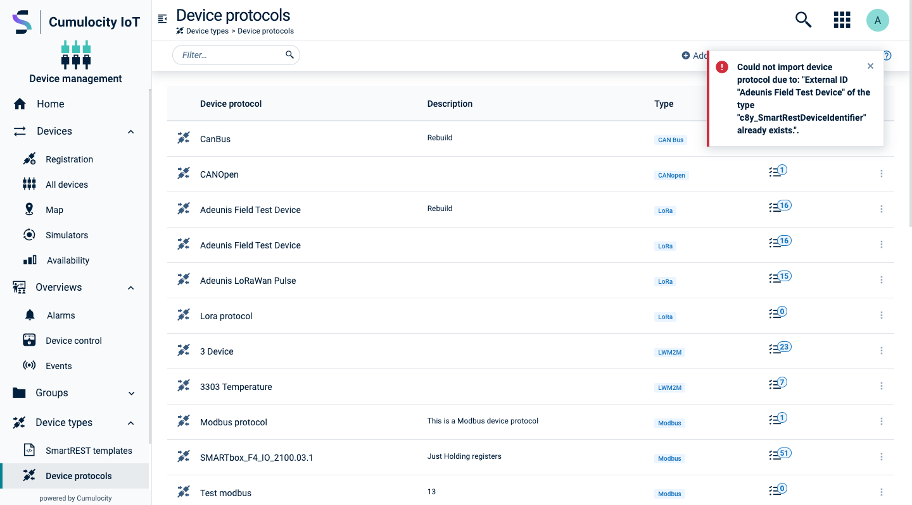
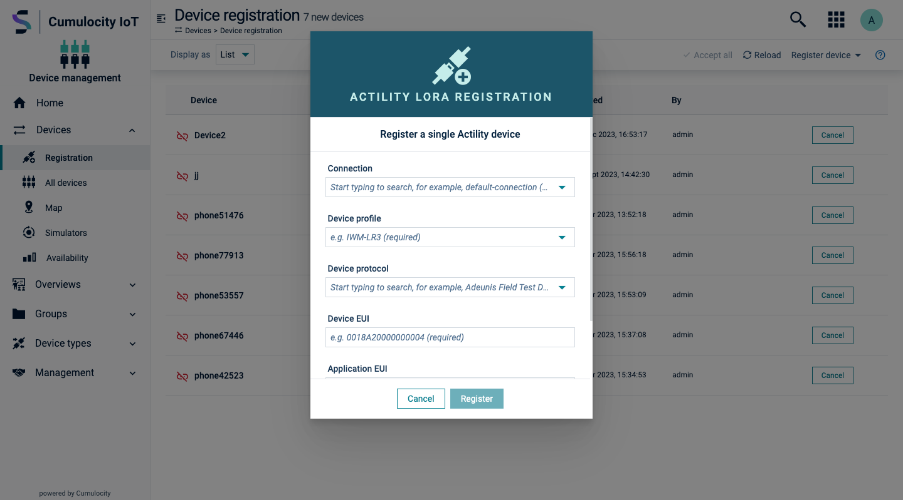
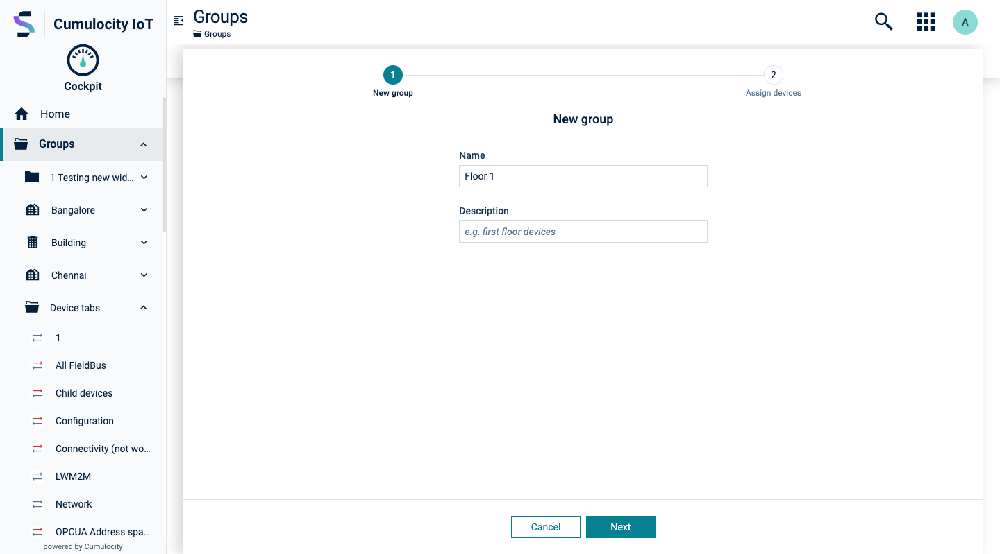
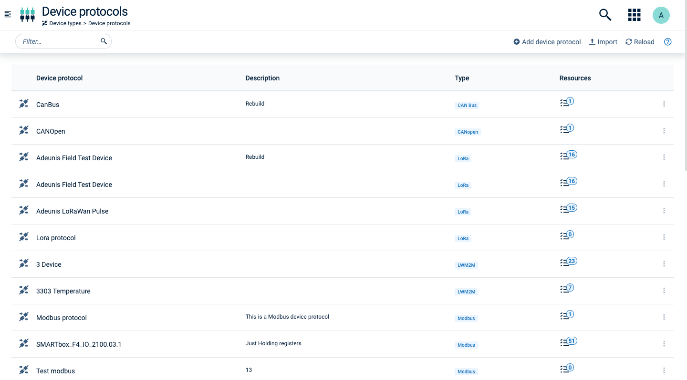

<!-- markdownlint-disable MD025 -->
<!-- markdownlint-disable MD033 -->
<!-- markdownlint-disable MD051 -->

Motion plays a crucial role in conveying the outcomes of user interactions, making them perceptible and comprehensible.

## Microinteractions

Microinteractions contribute to a seamless and responsive user experience, subtly enhancing efficiency.

Throughout the application, various elements employ microinteractions such as button states, dropdown menus, sliding and elevating elements, and collapsible containers. While many of these microinteractions are already integrated into the components, we also offer [motion utilities](#/utilities/motion) to further enhance the user experience.

  

    

      

        

          
Raise on hover

        

        
      

    

    

      

        

          
Slide from right

        

        
      

    

    

      

        

          
Slide from top

        

        
      

    

        

      

        

          
Slide from bottom

        

        
      

    

    

      

        

          
Collapse to the left

        

        
      

    

    

      

        

          
Expand from the right

        

        
      

    

  

