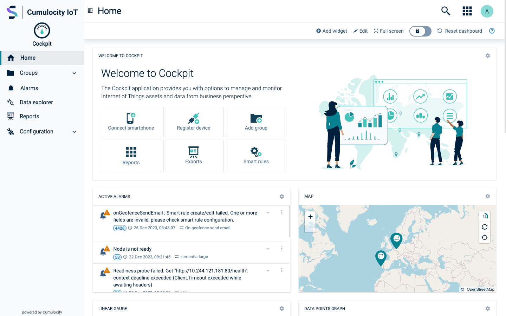
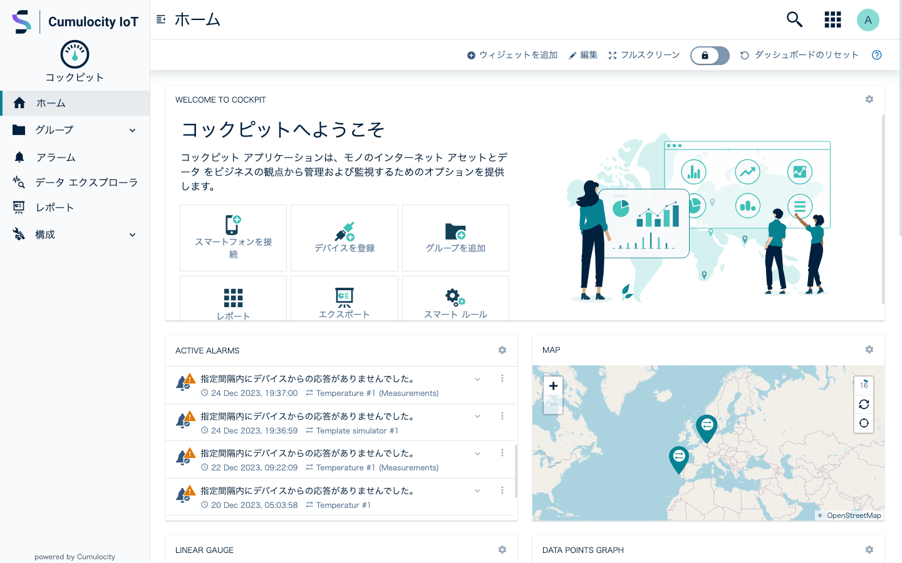
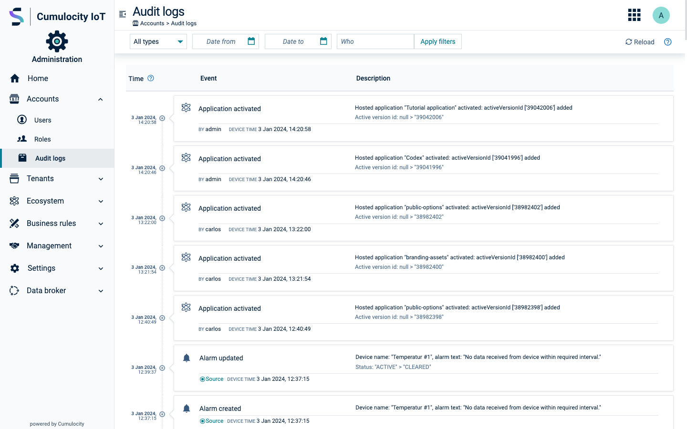
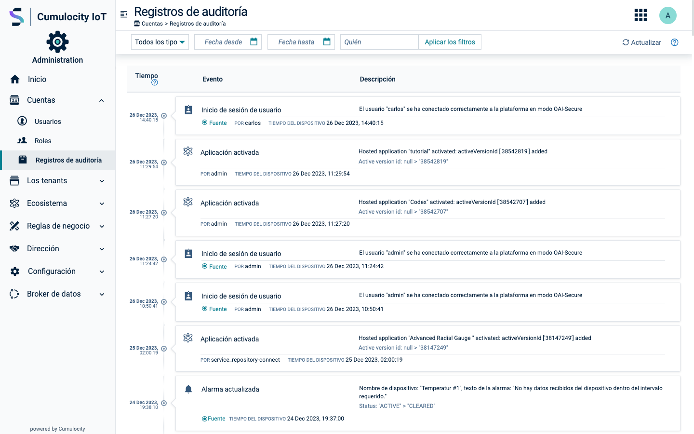
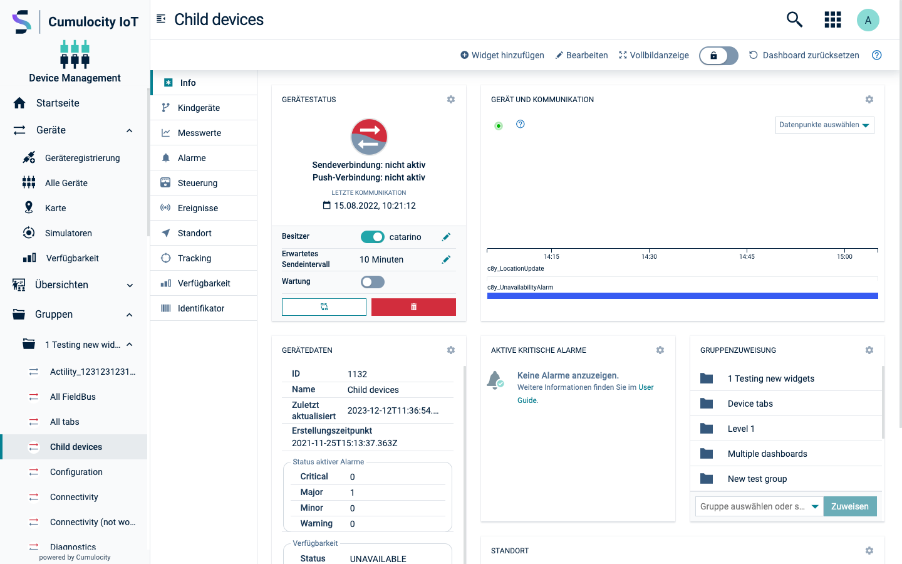
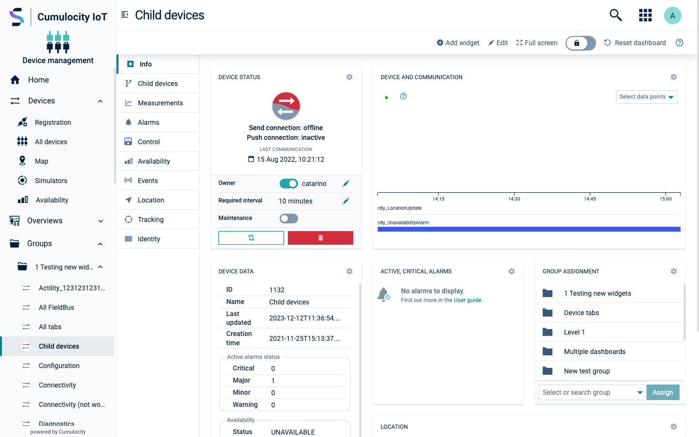

<!-- markdownlint-disable MD025 -->
<!-- markdownlint-disable MD033 -->

Provide a high-quality experience to international customers.

## Thinking global

Localization refers to the adaptation of a product, application or document content to meet the
language, cultural and other requirements of a specific target market. Often thought of only as a
synonym for translation of the user interface and documentation, localization is often a
substantially more complex issue.

Localization occurs as a fundamental step in the design and development process, rather than as an
afterthought. Whenever possible, involve a translator or a native speaker to review the whole
interface, not just the text.

### General rules of thumb

- Avoid metaphors and cultural references
- Remember that singular & plural can be very different
- Beware of the meaning of colors in different cultural contexts  
  (for example, in western cultures the color red indicates "danger", while in China it means "good luck")

### Key considerations during development

- Set the `lang` attribute on the HTML tag to ensure proper language settings throughout the
  document.
- Ensure that the chosen font-family supports multiple languages or define specific font families
  for different languages.
- Test and verify font sizes to ensure optimal readability across various devices and screen
  resolutions.
- Minimize the use of inline components and instead favor modular and reusable components for better
  maintainability and code organization.
- Remember to include the `translate` attribute on each piece of text to indicate whether it has to
  be translated or not.

## Text length and size expansion

- Reserve enough space for long texts
- For longer text, wrapping is a good solution; However, you must be aware of the potential
  layout change since translated text will take more vertical space
- Use truncation with care and be sure to add a <code>title</code> attribute with the full text

  

    

      

        

          
Cockpit (English)

        

        
      

    

    

      

        

          
Cockpit home (Japanese)

        

        
      

    

  

  

    

      

        

          
Audit logs (English)

        

        
      

    

    

      

        

          
Audit logs (Spanish)

        

        
      

    

  

  

    

      

        

          
Device detail (English)

        

        
      

    

    

      

        

          
Device detail (German)

        

        
      

    

  

