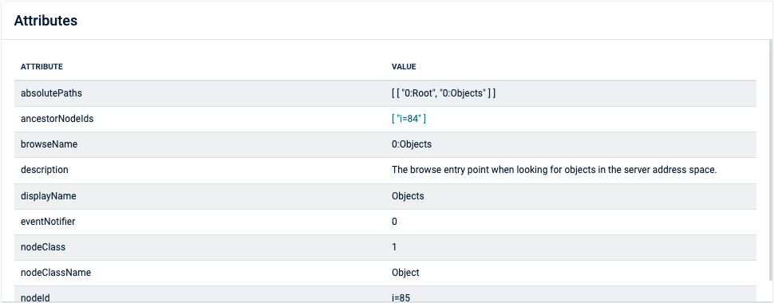
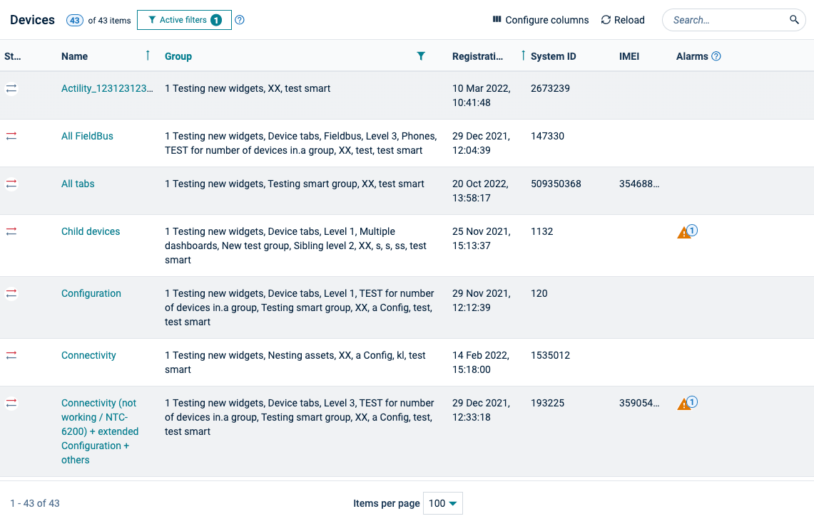

<!-- markdownlint-disable MD025 -->
<!-- markdownlint-disable MD033 -->
<!-- markdownlint-disable MD051 -->

A table is the most basic format for displaying a list of records. Each record is a single row of
data that begins with the record’s primary field and shows additional fields in subsequent columns.
The data is labeled using column headers which can be interactive.

This display type is appropriate for large numbers of records in which all columns must be visible,
allowing users to quickly scan and navigate the list using sorting, filtering or scrolling.

## Basic principles

- Tables must always be responsive
- Numerical data is right-aligned
- Textual data is left-aligned
- Buttons are right-aligned
- Headers are aligned with their data

## Examples

### Table

Check [tables](#/components/table) for more information.

  

### Data grid

Check [Data grid](#/components/data-grid) for more information.

  

