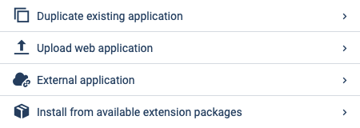
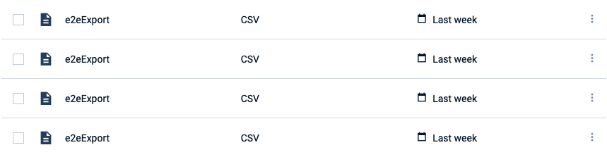
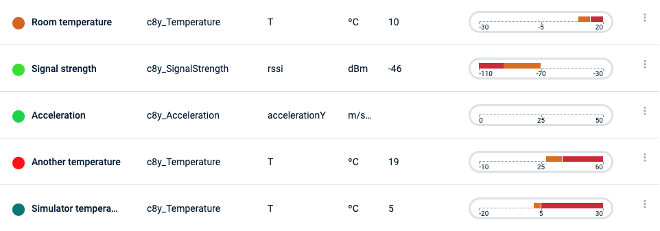

<!-- markdownlint-disable MD025 -->
<!-- markdownlint-disable MD033 -->
<!-- markdownlint-disable MD051 -->

A list group is a powerful way for displaying a list of records. It is flexible enough to use on
simple lists of elements or complex ones with custom content.

Primary fields are visible by default. Store additional fields in a collapsible container allowing a
less cluttered and responsive layout.

## Examples

Check [List group](#/components/list-group) for more info.

  

    

      
      
    

    

      
      
    

  

