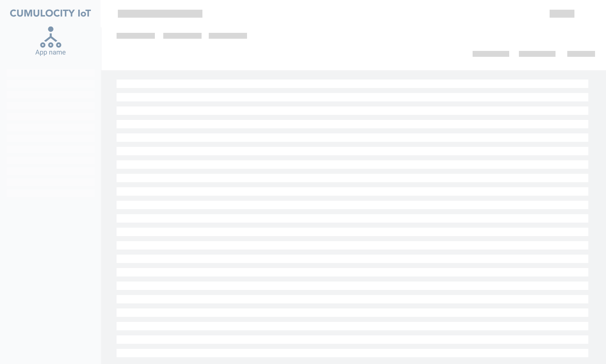
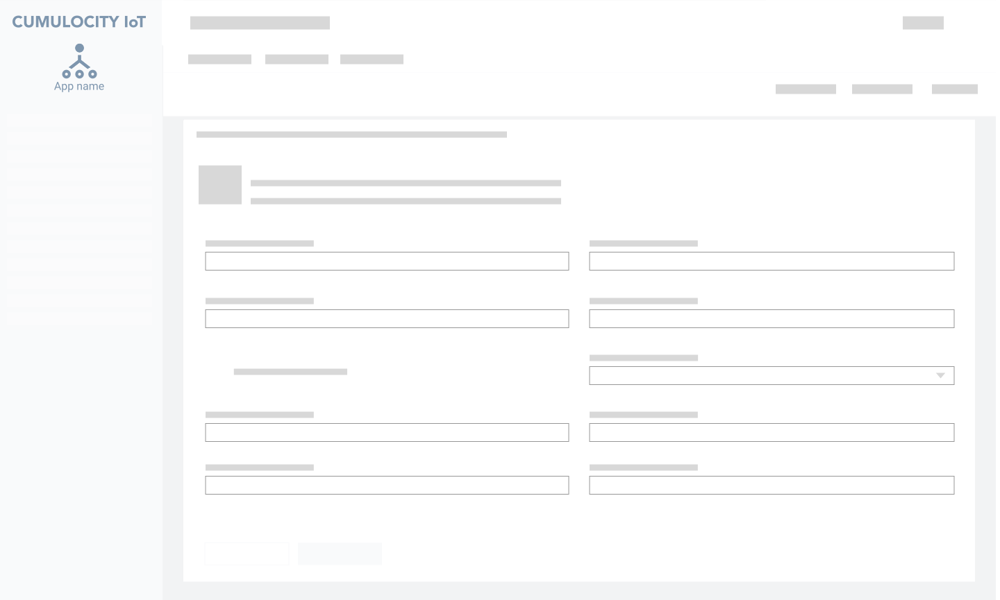
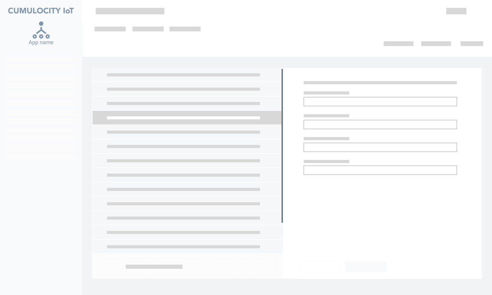
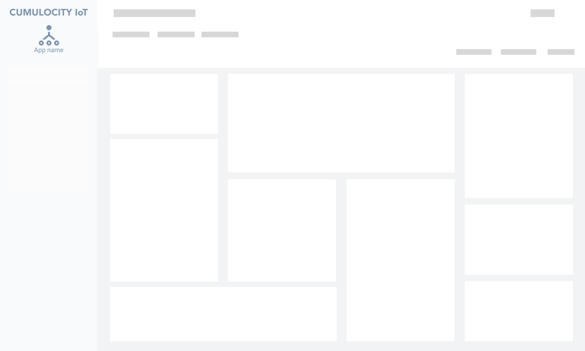

<!-- markdownlint-disable MD025 -->
<!-- markdownlint-disable MD033 -->

A properly structured layout enforces a consistent experience across interfaces.

### When choosing a layout, consider the following factors

1. **Identify the main tasks that users must accomplish**  
Understand the primary objectives that users want to achieve within the interface.
2. **Gather all the necessary information**  
Collect the relevant information required to make informed decisions. This ensures that the layout
supports the user's needs effectively.
3. **Define features and priorities**  
Based on the gathered information, determine the features and priorities associated with each task.
This step helps establish a hierarchy and guides the design process.

## Layouts

Layouts are divided into four groups, each designed to achieve specific objectives and address
different scenarios:

  

    
  

  

    <h4 class="m-t-32">1 - List layouts</h4>
    

      These layouts focus on helping users read basic information and easily perform actions on
      a list of records. They provide a clear overview and enable efficient interaction.
    

    <a  href="#/ui-guidelines/layouts/list-layouts">
      Learn more
    </a>
  

  

    
  

  

    <h4 class="m-t-32">2 - Detail layouts</h4>
    
Detail layouts are designed to provide users with access to in-depth information and allow
      them to perform specific configurations. They are particularly useful when users require a
      closer examination of individual items.

    <a  href="#/ui-guidelines/layouts/detail-layouts">
      Learn more
    </a>
  

  

    
  

  

    <h4 class="m-t-32">3 - Split view layouts</h4>
    
Split view layouts enable users to view, create, and edit multiple items while staying on
      the same screen. This layout is especially handy when users have to work on several items
      simultaneously.

    <a  href="#/ui-guidelines/layouts/split-view-layouts">
      Learn more
    </a>
  

  

    
  

  

    <h4 class="m-t-32">4 - Dashboard layouts</h4>
    
Dashboard layouts are tailored to present high-level information and guide users to related
      actions and details. They offer an overview of the system's key aspects and assist users
      in making informed decisions.

    <a  href="#/ui-guidelines/layouts/dashboard-layouts">
      Learn more
    </a>
  

