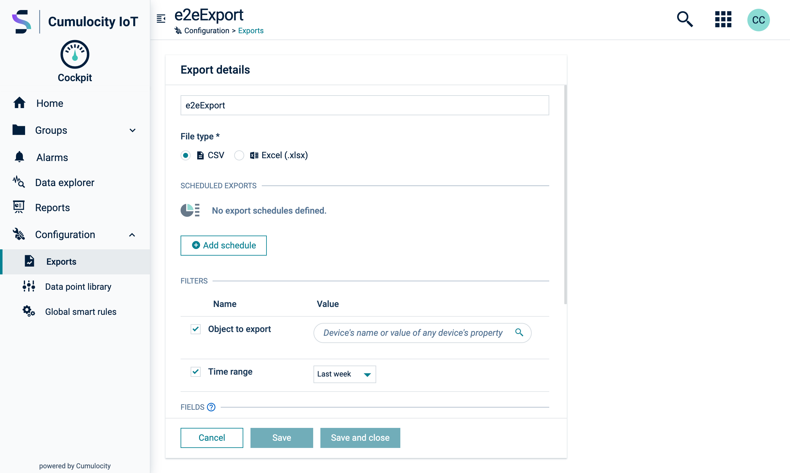
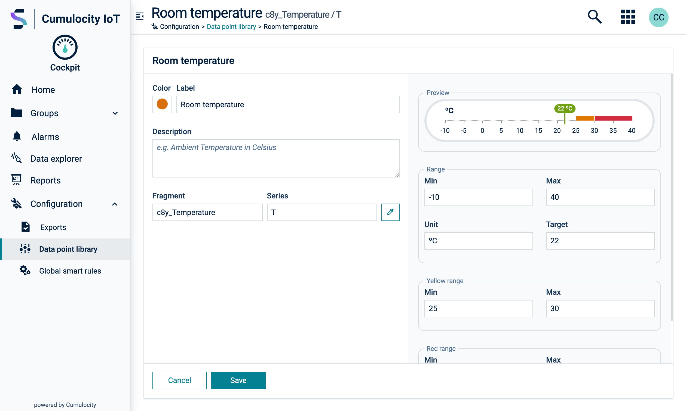
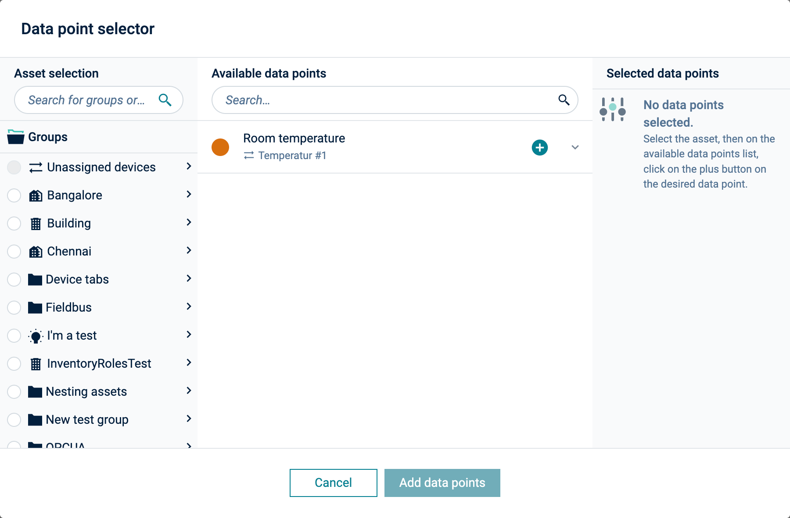

<!-- markdownlint-disable MD025 -->
<!-- markdownlint-disable MD033 -->
<!-- markdownlint-disable MD051 -->

The detail layout enables users access to the most detailed information on records and perform
specific configurations or operations. To present this information consistently, we use a
[card](#/components/card) as the container for the content.

To ensure efficiency, it is essential to prioritize information hierarchy when selecting a layout.  
Consider the following:

- **Component selection, spacing, and structured information hierarchy**: Choose components carefully, maintain appropriate spacing, and establish a well-structured hierarchy
for information presentation.
- **Utilize text with graphics**: Incorporate graphics along with text to enhance understanding and comprehension.
- **Avoid ambiguity**: Prevent confusion by using clear and unambiguous labels or descriptions.
- **Group related fields**: Simplify forms by grouping fields that are related to each other.

## Fullpage card

This layout features a single card that occupies the entire height of the screen, optionally
including a fixed header and/or footer. The card handles content overflow, eliminating the need for
scrollbars within the body.

It is suitable for displaying forms or lists of attributes. To limit the width, wrap the card in a
`col-**-**` container using the [grid system](#/utilities/using-the-grid/).

<codex-tutorial-example class="c8y-codex-override">
  

<!-- important -->

  

    <!-- header content -->
  

  <!-- scrolling container -->
  

    

      <!-- main content -->
    

  

  

    <!-- footer content -->
  

<!-- /important -->

</c8y-codex-example>

## Card grid

The Card grid layout is designed to accommodate complex record details. It consists of a card that
occupies the full height of the screen and contains multiple sections organized in columns and rows.
The card handles content overflow, eliminating the need for scrollbars within the body.

To maintain flexibility, sections within the card can be organized without a clear hierarchy. Each
section may contain various components such as forms, list-groups, buttons, or others.

Sections are separated either by two or three columns defined by `grid__col--*-*` and
`grid__col--*-*-*` on the 12-column grid.

For section rows, follow the same approach and use utility classes to set the size of two rows
out of a 12-row grid. For instance, if you want to allocate 2 rows with a relative size of 8 and 4,
use `grid__row--8-4`.  
For specific media queries, employ the appropriate suffix, such as `grid__col--4-4-4--sm` or
`grid__row--8-4--md`.

Refer to the [grid containers](#/utilities/grid-containers/) for more information.

### Two columns

The most common use case is for two columns specified as `grid__col--8-4` or `grid__col--6-6` for example.  
To visually differentiate sections, use the
[background color](#/utilities/color/overview#background-color) utility classes `.bg-level-*`.

<codex-tutorial-example class="c8y-codex-override">
  

  
  <!-- important -->

  <!-- the card header usually takes the full width -->
  

    

      Card title
    

  

  <!-- the column containers -->
  

    

      First section: 6 / 12 columns
    

  

  

    

      Second section: 6 / 12 columns
    

  

  <!-- the card footer also taking the full width -->
  

    <button class="btn btn-default" type="button" >
      Cancel
    </button>
    <button class="btn btn-primary">
      Save
    </button>
  

  <!-- /important -->

</c8y-codex-example>

### Three columns

In cases where three columns better suit the content, for example, `grid__col--3-6-3`.

<codex-tutorial-example class="c8y-codex-override">
  

  
  <!-- important -->

  <!-- the card header usually takes the full width -->
  

    

      Card title
    

  

  <!-- the column containers -->
  

    

      First section: 3 / 12 columns
    

  

  

    

      Second section: 6 / 12 columns
    

  

  

    

      third section: 3 / 12 columns
    

  

  <!-- the card footer also taking the full width -->
  

    <button class="btn btn-default" type="button" >
      Cancel
    </button>
    <button class="btn btn-primary">
      Save
    </button>
  

  <!-- /important -->

</c8y-codex-example>

## Settings card

The Settings card layout is specifically designed for displaying lengthy forms within a single card
that comprises multiple sections. It is primarily used for platform settings and configuration.

To implement this layout, use the [grid system](#/utilities/using-the-grid) to provide two
columns: one for the section name and the other for data entry.

<codex-tutorial-example class="c8y-codex-override">
  

    
<!-- important -->

  

    Card title
  

  

    <!-- repeat the block below for each section -->
    

      

        

          <h4 class="text-normal text-right text-left-xs" translate>
           Section 1
          </h4>
        

        

          Section 1 content
        

      

    

    <!-- end of the block -->
    

      

        

          <h4 class="text-normal text-right text-left-xs" translate>
           Section 2
          </h4>
        

        

          Section 2 content
        

      

    

  

  <!-- the footer, if required -->
  

    <button class="btn btn-default">
      Cancel
    </button>
    <button class="btn btn-primary">
      Save
    </button>
  

<!-- /important -->

</codex-tutorial-example>
