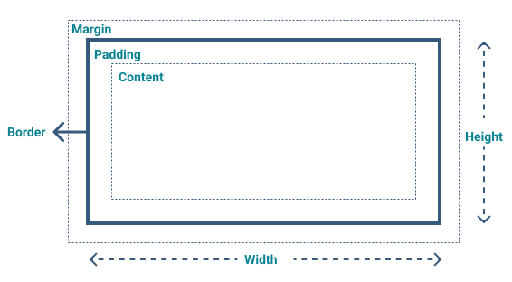

<!-- markdownlint-disable MD033 -->
<!-- markdownlint-disable MD025 -->
<!-- markdownlint-disable MD051 -->

The CSS box model contains block boxes and defines how the various components — margin, border,
padding, and content — interact to form a visible box on a page.

While inline boxes adhere to certain aspects of the box model, their behavior differs to some extent.

Below you can find the utility classes designed to streamline the handling of size, margin, and padding
properties. With these classes, you can effortlessly manage element sizes, create consistent spacing
with margins, and align content using padding.

If you are looking for more advanced layout options, such as aligning and distributing space between
items within a container, we recommend exploring the [grid system](#/ui-guidelines/utilities/using-the-grid/overview).
It provides powerful tools for creating responsive and organized layouts.

## Width and Height

We provide utility classes to conveniently adjust the width and height of elements. These classes may override size constraints set by other.

<codex-tutorial-example class="c8y-codex-override">
  

    

<!-- important -->

  <code>fit-w</code>
  
When applied in block-level elements, takes 100% width of the parent container.

  

    <code>fit-h</code>
    
When applied in block-level elements, takes 100% height of the parent container.

  

    <code>fit-h-20</code>
    

    
When applied in block-level elements, sets the elements' height to match the text line-height.

  

<!-- /important -->
    

  

</codex-tutorial-example>

## Max-width, Min-width, Max-height, and Min-height

To control the size of elements in relation to their parent container, we must handle the properties
`max-width`, `min-width`, `max-height`, and `min-height`:

- `max-width` sets the upper limit for the element's width, preventing it from exceeding the specified value.
- `min-width` ensures the element's width does not go below the specified value, providing a minimum width.
- `max-height` limits the element's height to the specified value, preventing it from surpassing it.
- `min-height` guarantees the element has a minimum height, ensuring it won't become too small.

You can take advantage of our utility classes to conveniently manage these size properties and
adapt elements within their containers as needed.

<codex-tutorial-example class="c8y-codex-override">
  

    

<!-- important -->

  <code>max-width-100</code>
  

    The width of this element is set to 3000px, but it's limited to 100% width of the parent
    container.
  

  

    <code>max-width-inherit</code>
    

      This element has 300px of max-width inherited from the parent container, although the
      parent container has the display property set to <code>contents</code>.
    

  

  <code>max-width-unset</code>
  
This element has the max-width set to the default value (<em>auto</em>).

  <code>max-width-fit</code>
  
This element's max-width matches the content width.

  

    <code>min-width-100</code>
    

      The minimum width of this element is 100% width of the parent container, but it may be wider.
    

  

  <code>min-width-unset</code>
  
This element has the min-width set to the default value (<em>auto</em>).

  

    <code>min-width-0</code>
    

      By default, flex items won't shrink below their minimum content size (the length of the
      longest word or fixed-size element). Use this class to override that.
    

  

  <code>min-height-unset</code>
  
This element has the min-height set to the default value (<em>auto</em>).

  

    <code>min-height-100</code>
    

      The minimum height of this element is 100% height of the parent container, but it may be taller.
    

  

  

    <code>min-height-0</code>
    

      By default, flex items won't shrink below their minimum content size (the height of the text
       or fixed-size element). Use this class to override that.
    

  

<!-- /important -->
    

  

</codex-tutorial-example>

## Margin

Class names for margin are composed of 2, 3 or 4 blocks, for example, `m-t-8` or `m-t-md-32`:

- The first block indicates the `m`argin.
- The second block represents the side: `t`op, `r`ight, `b`ottom, or `l`eft. Omitting the second
  block will apply the margin to all sides.
- The third block (for example, `md`) is optional and can be used to target specific screen sizes responsively. Alternatively, you
  can omit it to apply the margin to all screen sizes.
- The fourth block indicates the amount (for example, `8`), starting with 4px, followed by increments of 8px up to
  a maximum of 80px.

<codex-tutorial-example class="c8y-codex-override">

  

  

      

<!-- important -->

  <code>.m-4</code>
  
margin: 4px

<!-- /important -->
      

      

<!-- important -->

  <code>.m-8</code>
  
margin: 8px

<!-- /important -->
      

      

<!-- important -->

  <code>.m-16</code>
  
margin: 16px

<!-- /important -->
      

      

<!-- important -->

  <code>.m-24</code>
  
margin: 24px

<!-- /important -->
      

      

<!-- important -->

  <code>.m-32</code>
  
margin: 32px

<!-- /important -->
      

      

<!-- important -->

  <code>.m-40</code>
  
margin: 40px

<!-- /important -->
      

    

  

    

<!-- important -->

  <code>.m-t-4</code>
  
margin-top: 4px

<!-- /important -->
    

    

<!-- important -->

  <code>.m-t-8</code>
  
margin-top: 8px

<!-- /important -->
    

    

<!-- important -->

  <code>.m-t-16</code>
  
margin-top: 16px

<!-- /important -->
    

    

<!-- important -->

  <code>.m-t-24</code>
  
margin-top: 24px

<!-- /important -->
    

    

<!-- important -->

  <code>.m-t-32</code>
  
margin-top: 32px

<!-- /important -->
    

    

<!-- important -->

  <code>.m-t-40</code>
  
margin-top: 40px

<!-- /important -->
    

  

  

    

<!-- important -->

  <code>.m-r-4</code>
  
margin-right: 4px

<!-- /important -->
    

    

<!-- important -->

  <code>.m-r-8</code>
  
margin-right: 8px

<!-- /important -->
    

    

<!-- important -->

  <code>.m-r-16</code>
  
margin-right: 16px

<!-- /important -->
    

    

<!-- important -->

  <code>.m-r-24</code>
  
margin-right: 24px

<!-- /important -->
    

    

<!-- important -->

  <code>.m-r-32</code>
  
margin-right: 32px

<!-- /important -->
    

    

<!-- important -->

  <code>.m-r-40</code>
  
margin-right: 40px

<!-- /important -->
    

  

  

    

<!-- important -->

  <code>.m-b-4</code>
  
margin-bottom: 4px

<!-- /important -->
      
Other element

    

    

<!-- important -->

  <code>.m-b-8</code>
  
margin-bottom: 8px

<!-- /important -->
      
Other element

    

    

<!-- important -->

  <code>.m-b-16</code>
  
margin-bottom: 16px

<!-- /important -->
      
Other element

    

    

<!-- important -->

  <code>.m-b-24</code>
  
margin-bottom: 24px

<!-- /important -->
      
Other element

    

    

      <!-- important -->

  <code>.m-b-32</code>
  
margin-bottom: 32px

<!-- /important -->
      
Other element

    

    

<!-- important -->

  <code>.m-b-40</code>
  
margin-bottom: 40px

<!-- /important -->
      
Other element

    

  

  

    

<!-- important -->

  <code>.m-l-4</code>
  
margin-left: 4px

<!-- /important -->
    

    

<!-- important -->

  <code>.m-l-16</code>
  
margin-left: 8px

<!-- /important -->
    

    

<!-- important -->

  <code>.m-l-16</code>
  
margin-left: 16px

<!-- /important -->
    

    

<!-- important -->

  <code>.m-l-24</code>
  
margin-left: 24px

<!-- /important -->
    

    

<!-- important -->

  <code>.m-l-32</code>
  
margin-left: 32px

<!-- /important -->
    

    

<!-- important -->

  <code>.m-l-40</code>
  
margin-left: 40px

<!-- /important -->
    

  

</codex-tutorial-example>

## Padding

The class names are composed by 2, 3 blocks or 4 blocks, for example, <code>p-t-24</code> or <code>p-t-xs-0</code>:

- The first block refers to the `p`adding.
- The second to the side, `t`op, `r`ight, `b`ottom, and `l`eft. Just like in CSS, omitting it will
  apply on all sides.
- The third block is optional (for example, `xs`), you can either use it to targets specific screen sizes responsively or you can
  omit to target all screen sizes.
- The fourth refers to amount (for example, `24`), starting with `4px`, then `8px` followed by multiples of `8` up to
  `80`.

<codex-tutorial-example class="c8y-codex-override">
  

    

  

    

<!-- important -->

  <code>.p-4</code>
  
padding: 4px

<!-- /important -->
    

    

<!-- important -->

  <code>.p-8</code>
  
padding: 8px

<!-- /important -->
    

    

<!-- important -->

  <code>.p-16</code>
  
padding: 16px

<!-- /important -->
    

    

<!-- important -->

  <code>.p-24</code>
  
padding: 24px

<!-- /important -->
    

    

<!-- important -->

  <code>.p-32</code>
  
padding: 32px

<!-- /important -->
    

    

<!-- important -->

  <code>.p-40</code>
  
padding: 40px

<!-- /important -->
    

  

  

    

<!-- important -->

  <code>.p-t-4</code>
  
padding-top: 4px

<!-- /important -->
    

    

<!-- important -->

  <code>.p-t-8</code>
  
padding-top: 8px

<!-- /important -->
    

    

<!-- important -->

  <code>.p-t-16</code>
  
padding-top: 16px

<!-- /important -->
    

    

<!-- important -->

  <code>.p-t-24</code>
  
padding-top: 24px

<!-- /important -->
    

    

<!-- important -->

  <code>.p-t-32</code>
  
padding-top: 32px

<!-- /important -->
    

    

<!-- important -->

  <code>.p-t-40</code>
  
padding-top: 40px

<!-- /important -->
    

  

  

    

<!-- important -->

  <code>.p-r-4</code>
  
padding-right: 4px

<!-- /important -->
    

    

<!-- important -->

  <code>.p-r-8</code>
  
padding-right: 8px

<!-- /important -->
    

    

<!-- important -->

  <code>.p-r-16</code>
  
padding-right: 16px

<!-- /important -->
    

    

<!-- important -->

  <code>.p-r-24</code>
  
padding-right: 24px

<!-- /important -->
    

    

<!-- important -->

  <code>.p-r-32</code>
  
padding-right: 32px

<!-- /important -->
    

    

<!-- important -->

  <code>.p-r-40</code>
  
padding-right: 40px

<!-- /important -->
    

  

  

    

<!-- important -->

  <code>.p-b-4</code>
  
padding-bottom: 4px

<!-- /important -->
    

    

<!-- important -->

  <code>.p-b-8</code>
  
padding-bottom: 8px

<!-- /important -->
    

    

<!-- important -->

  <code>.p-b-16</code>
  
padding-bottom: 16px

<!-- /important -->
    

    

<!-- important -->

  <code>.p-b-24</code>
  
padding-bottom: 24px

<!-- /important -->
    

    

<!-- important -->

  <code>.p-b-32</code>
  
padding-bottom: 32px

<!-- /important -->
    

    

<!-- important -->

  <code>.p-b-40</code>
  
padding-bottom: 40px

<!-- /important -->
    

  

  

    

<!-- important -->

  <code>.p-l-4</code>
  
padding-left: 4px

<!-- /important -->
    

    

<!-- important -->

  <code>.p-l-16</code>
  
padding-left: 8px

<!-- /important -->
    

    

<!-- important -->

  <code>.p-l-16</code>
  
padding-left: 16px

<!-- /important -->
    

    

<!-- important -->

  <code>.p-l-24</code>
  
padding-left: 24px

<!-- /important -->
    

    

<!-- important -->

  <code>.p-l-32</code>
  
padding-left: 32px

<!-- /important -->
    

    

<!-- important -->

  <code>.p-l-40</code>
  
padding-left: 40px

<!-- /important -->
    

  

</codex-tutorial-example>
